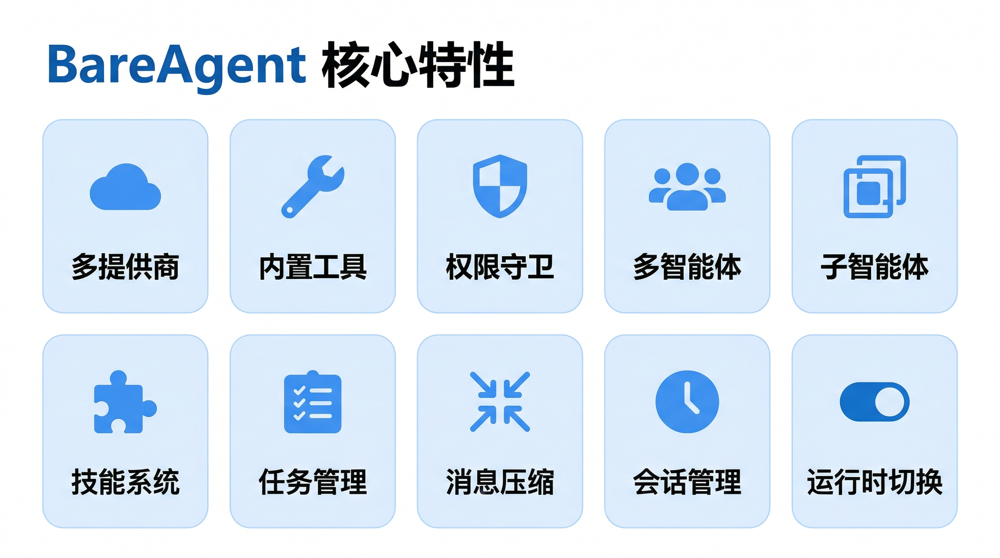
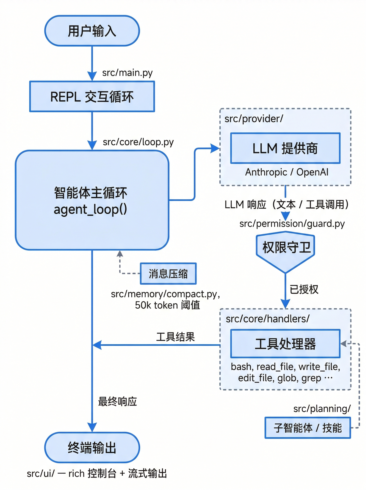
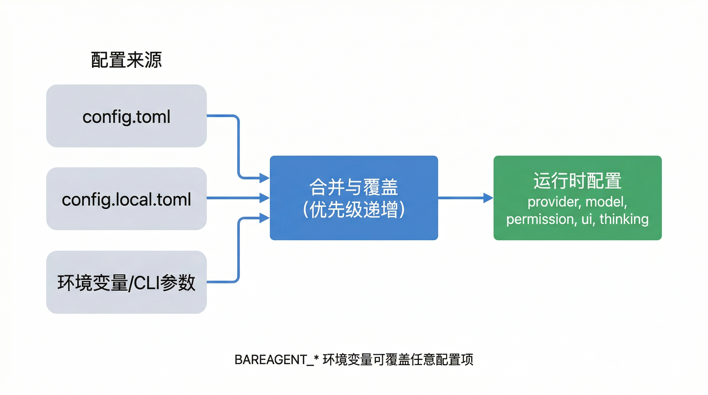
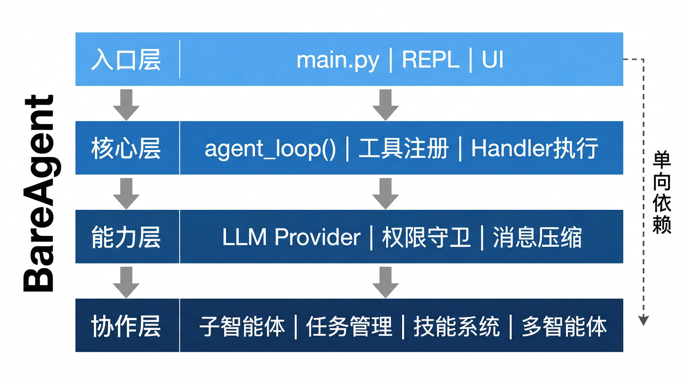

# BareAgent

> 纯 Python 终端代码智能体 — 可插拔 LLM、细粒度权限、多智能体协调、可扩展技能系统

<!-- badges placeholder -->


---

## ✨ 核心特性

<p align="center">
  
</p>

| 特性 | 说明 |
|------|------|
| **多提供商支持** | Anthropic / OpenAI / DeepSeek，统一接口，流式与非流式输出自由切换 |
| **内置工具** | bash、文件读写编辑、glob、grep 等开箱即用，延迟加载按需注册 |
| **权限守卫** | 四种模式（DEFAULT / AUTO / PLAN / BYPASS），危险命令自动拦截 |
| **多智能体协调** | 基于 JSONL 邮箱的消息总线，守护进程式自治智能体，请求-响应协议 |
| **子智能体委派** | 隔离上下文、递归深度限制、类型化智能体（explore/plan/code-review）、后台异步执行 |
| **技能系统** | 从 `skills/*/SKILL.md` 自动发现，按需加载（code-review、git、test） |
| **任务管理** | 持久化任务 + 会话级 TODO，支持依赖追踪和优先级 |
| **消息压缩** | 微压缩 + LLM 摘要，基于 token 阈值（50k）触发，支撑超长对话 |
| **会话管理** | 会话转录持久化，支持列出历史会话和恢复上下文 |
| **运行时切换** | 斜杠命令或 `Shift+Tab` 快捷键实时切换权限模式，无需重启 |

---

## 🏗️ 架构概览

<p align="center">
  
</p>

核心循环 `agent_loop()` 是中央调度器：**调用 LLM → 解析工具调用 → 权限检查 → 执行处理器 → 收集结果**，最多迭代 200 次。支持流式输出和长对话消息自动压缩。

---

## 🚀 快速开始

### 环境要求

- Python 3.12+
- [uv](https://github.com/astral-sh/uv)（推荐）

### 安装

```bash
uv pip install -e ".[dev]"
```

### 配置

#### API Key 设置

```bash
# Linux / macOS
export OPENAI_API_KEY="your-key-here"
```

```powershell
# Windows PowerShell（当前会话）
$env:OPENAI_API_KEY="your-key-here"

# Windows PowerShell（永久生效）
[Environment]::SetEnvironmentVariable("OPENAI_API_KEY", "your-key-here", "User")
```

#### 配置文件

默认配置在 `config.toml`，本地覆盖写入 `config.local.toml`（已 git-ignore）：

```toml
[provider]
name = "openai"
model = "gpt-4.1"
api_key_env = "OPENAI_API_KEY"

[permission]
mode = "default"

[ui]
stream = true
theme = "dark"

[thinking]
mode = "adaptive"
budget_tokens = 10000

[subagent]
max_depth = 3
default_type = "general-purpose"
```

#### 环境变量

<p align="center">
  
</p>

配置优先级：`config.toml` → `config.local.toml` → 环境变量 / CLI 参数（优先级递增）。

| 环境变量 | 说明 | 默认值 |
|---------|------|--------|
| `BAREAGENT_PROVIDER` | 提供商名称 | `openai` |
| `BAREAGENT_MODEL` | 模型名称 | `gpt-4.1` |
| `BAREAGENT_API_KEY_ENV` | API 密钥环境变量名 | 按提供商自动设置 |
| `BAREAGENT_BASE_URL` | 自定义 API 基础 URL | — |
| `BAREAGENT_PERMISSION_MODE` | 权限模式 | `default` |
| `BAREAGENT_UI_STREAM` | 是否流式输出 | `true` |
| `BAREAGENT_UI_THEME` | UI 主题 | `dark` |
| `BAREAGENT_THINKING_MODE` | 思考模式（adaptive/enabled/disabled） | `adaptive` |
| `BAREAGENT_THINKING_BUDGET_TOKENS` | 思考 token 预算 | `10000` |
| `BAREAGENT_SKILLS_DIR` | 技能目录路径 | 自动发现 |
| `BAREAGENT_SUBAGENT_MAX_DEPTH` | 子智能体最大递归深度 | `3` |
| `BAREAGENT_SUBAGENT_DEFAULT_TYPE` | 子智能体默认类型 | `general-purpose` |

### 运行

```bash
bareagent
# 或
python -m src.main
```

#### CLI 参数

```bash
bareagent --provider anthropic --model claude-sonnet-4-20250514
bareagent --provider openai --model gpt-4.1
bareagent --config ~/my_config.toml
```

| 参数 | 说明 |
|------|------|
| `--provider` | 覆盖配置文件中的 LLM 提供商（anthropic / openai / deepseek） |
| `--model` | 覆盖配置文件中的模型名称 |
| `--config` | 指定 TOML 配置文件路径（默认 `config.toml`，支持 `~` 扩展） |

---

## 💻 REPL 命令速查

| 命令 | 说明 |
|------|------|
| `/help` | 显示帮助信息，列出所有可用命令 |
| `/exit` | 退出 BareAgent，广播关闭信号给所有团队成员 |
| `/clear` | 清屏并启动新对话（重置消息历史和会话 ID） |
| `/new` | 启动新对话（仅重置消息，不清屏） |
| `/compact` | 压缩对话上下文，生成 LLM 摘要释放 token |
| `/default` | 切换到 DEFAULT 权限模式 |
| `/auto` | 切换到 AUTO 权限模式 |
| `/plan` | 切换到 PLAN 权限模式（只读） |
| `/bypass` | 切换到 BYPASS 权限模式（无确认） |
| `/mode` | 交互式权限模式选择菜单 |
| `/sessions` | 列出已保存的历史会话 |
| `/resume [id]` | 恢复上一个会话（可选指定会话 ID） |
| `/team` | 管理团队智能体（子命令：`list`、`spawn <name>`、`send <name> <msg>`） |

**快捷键：**

| 按键 | 功能 |
|------|------|
| `Shift+Tab` | 循环切换权限模式（DEFAULT → AUTO → PLAN → BYPASS） |
| `Ctrl+C` | 中断当前操作（按两次退出） |
| `Ctrl+Z` | 立即退出 REPL |

---

## 🔐 权限模式

| 模式 | 行为 | 适用场景 |
|------|------|---------|
| **DEFAULT** | 写操作需用户确认，安全工具自动批准 | 日常使用（默认） |
| **AUTO** | 安全命令（ls、cat、git status、pytest 等）自动通过，仅拦截危险命令 | 信任环境下的高效开发 |
| **PLAN** | 只允许只读工具，所有写操作被阻止 | 代码审查、方案设计 |
| **BYPASS** | 所有操作自动批准，无任何确认 | 完全信任的自动化场景 |

切换方式：`/default`、`/auto`、`/plan`、`/bypass`、`/mode` 或 `Shift+Tab`。

---

## 📁 项目结构

<p align="center">
  
</p>

```
src/
├── main.py                # 入口与 REPL 循环
├── core/                  # 智能体循环、工具注册、Schema、沙箱
│   ├── loop.py            #   核心 agent_loop()
│   ├── tools.py           #   工具注册与分发
│   ├── schema.py          #   工具 Schema 定义
│   ├── context.py         #   系统提示组装
│   ├── sandbox.py         #   路径安全检查
│   ├── fileutil.py        #   文件工具函数
│   └── handlers/          #   各工具处理器实现
├── provider/              # LLM 提供商抽象
│   ├── base.py            #   BaseLLMProvider
│   ├── anthropic.py       #   Anthropic 实现
│   ├── openai.py          #   OpenAI 实现
│   └── factory.py         #   工厂
├── permission/            # 权限守卫
│   ├── guard.py           #   PermissionGuard（4 种模式）
│   └── rules.py           #   权限规则解析
├── memory/                # 消息压缩与会话管理
│   ├── compact.py         #   Compactor（微压缩 + LLM 摘要）
│   ├── token_counter.py   #   Token 估算
│   └── transcript.py      #   会话转录管理
├── planning/              # 任务、TODO、技能、子智能体
│   ├── agent_types.py     #   智能体类型系统
│   ├── subagent.py        #   子智能体委派
│   ├── tasks.py           #   持久化任务管理
│   ├── todo.py            #   会话级 TODO
│   └── skills.py          #   技能发现与加载
├── team/                  # 多智能体协调
│   ├── mailbox.py         #   JSONL 消息总线
│   ├── autonomous.py      #   自治智能体守护进程
│   ├── manager.py         #   TeammateManager
│   └── protocols.py       #   请求-响应协议
├── concurrency/           # 后台执行与通知
│   ├── background.py      #   BackgroundManager
│   └── notification.py    #   后台通知
└── ui/                    # 终端 UI（rich + 流式）
    ├── console.py         #   AgentConsole
    └── stream.py          #   StreamPrinter
skills/                    # 可扩展技能模块
tests/                     # pytest 测试
```

---

## 🔗 完整文档

项目提供基于 [VitePress](https://vitepress.dev/) 的完整文档，涵盖架构设计、模块详解、开发指南等 15 个章节：

```bash
cd docs
npm install
npm run docs:dev
```

文档源码位于 [`docs/`](docs/) 目录。

---

## 🛠️ 开发

```bash
# 测试
pytest                             # 全部测试
pytest tests/test_loop.py          # 单个文件
pytest tests/test_loop.py -k "test_name"  # 单个测试

# 代码检查与格式化
ruff check src tests               # 检查
ruff check --fix src tests          # 自动修复
ruff format src tests               # 格式化
```

提交信息遵循 Conventional Commits：`Fix:`、`Feat:`、`Refactor:`、`Test:`、`Docs:`

---

## 📄 许可证

[MIT](LICENSE)
