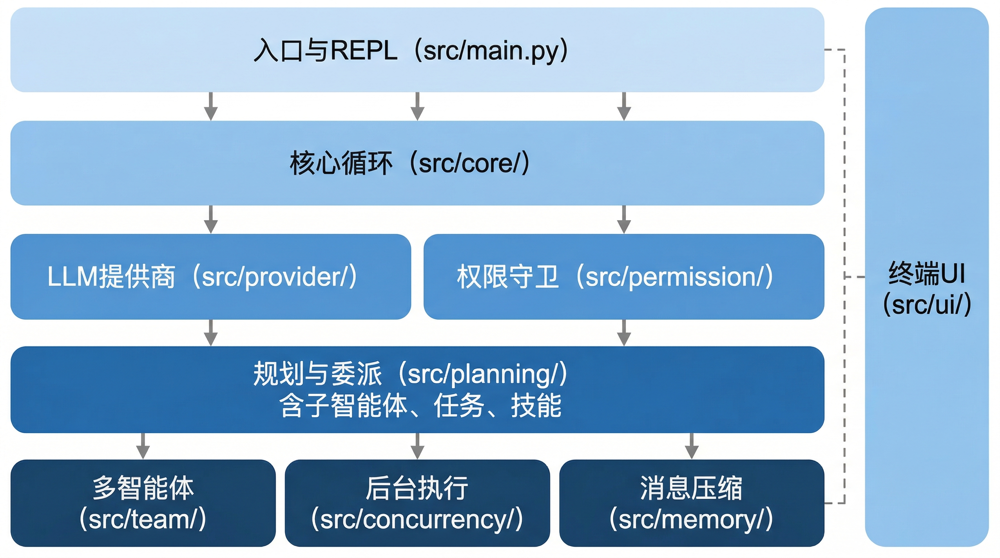

# 概述

## 1.1 项目简介

BareAgent 是一个纯 Python 终端代码智能体。它在终端环境中为开发者提供 AI 编程助手能力，支持文件操作、代码搜索、命令执行、任务管理等日常开发工作流。

与 IDE 插件或 Web 界面不同，BareAgent 直接运行在终端中，通过交互式 REPL 与开发者对话，调用 LLM 理解意图并执行工具完成任务。它的设计目标是：

- **轻量可控** — 纯 Python 实现，无重型框架依赖，开发者对每一步操作拥有完整的可见性和控制权
- **可插拔** — LLM 提供商、工具、技能均可替换和扩展
- **安全优先** — 细粒度权限模型，危险命令自动拦截，子智能体权限隔离

技术基础：

- Python 3.12+
- [Hatchling](https://hatch.pypa.io/) 构建系统
- MIT 许可证

## 1.2 核心特性

| 特性 | 说明 |
|------|------|
| **可插拔 LLM 提供商** | 支持 Anthropic、OpenAI 等提供商，统一接口，流式与非流式输出，可通过配置切换 |
| **内置工具系统** | 开箱即用的 bash、文件读写编辑、glob、grep 等基础工具，以及按需延迟加载的 todo、task、subagent、技能等高级工具 |
| **细粒度权限控制** | 四种权限模式（DEFAULT / AUTO / PLAN / BYPASS），内置危险命令模式检测（rm -rf、force push、DROP TABLE 等），支持 allow/deny 规则 |
| **子智能体委派** | 4 种内置智能体类型（general-purpose / explore / plan / code-review），递归深度控制，权限隔离，后台异步执行 |
| **多智能体协调** | 基于 JSONL 的消息总线，协议状态机（PLAN_APPROVAL / SHUTDOWN），守护进程式自治智能体 |
| **可扩展技能系统** | 从 `skills/*/SKILL.md` 自动发现技能，通过 `load_skill` 工具按需加载，内置 code-review、git、test 技能 |
| **消息压缩** | 微压缩截断旧工具结果 + LLM 摘要生成，基于 50k token 阈值自动触发，支撑超长对话 |
| **会话管理** | 会话转录持久化，支持列出历史会话（`/sessions`）和恢复（`/resume`） |

## 1.3 架构总览

### 核心循环

BareAgent 的核心是 `agent_loop()`——一个迭代式的 LLM 调用-工具执行循环。整体数据流如下：

每轮迭代中，`agent_loop()` 将对话历史发送给 LLM，解析返回的工具调用请求，经权限守卫检查后交由对应处理器执行，最后将结果追加到对话历史中。循环最多执行 200 次迭代，并在 token 接近阈值时自动触发消息压缩。

### 模块结构

| 模块 | 路径 | 职责 |
|------|------|------|
| 入口与 REPL | `src/main.py` | 命令行入口、交互式 REPL 循环、斜杠命令处理 |
| 核心循环 | `src/core/` | agent_loop、工具注册与 Schema、处理器、系统提示组装 |
| LLM 提供商 | `src/provider/` | 抽象基类、Anthropic/OpenAI 实现、工厂创建 |
| 权限守卫 | `src/permission/` | 四种权限模式、危险命令检测、allow/deny 规则 |
| 消息与会话 | `src/memory/` | 消息压缩（微压缩 + LLM 摘要）、token 估算、会话转录 |
| 规划与委派 | `src/planning/` | 智能体类型、子智能体委派、任务管理、TODO、技能系统 |
| 多智能体 | `src/team/` | 消息总线、协议状态机、自治智能体、队友管理 |
| 后台执行 | `src/concurrency/` | 后台任务管理、完成通知 |
| 终端 UI | `src/ui/` | 基于 rich 的控制台输出、流式打印 |

各模块之间的依赖关系保持单向：`core` 调用 `provider` 和 `permission`，`planning` 依赖 `core`，`team` 依赖 `planning`，`ui` 仅负责展示。这种分层设计使得各模块可以独立测试和替换。

