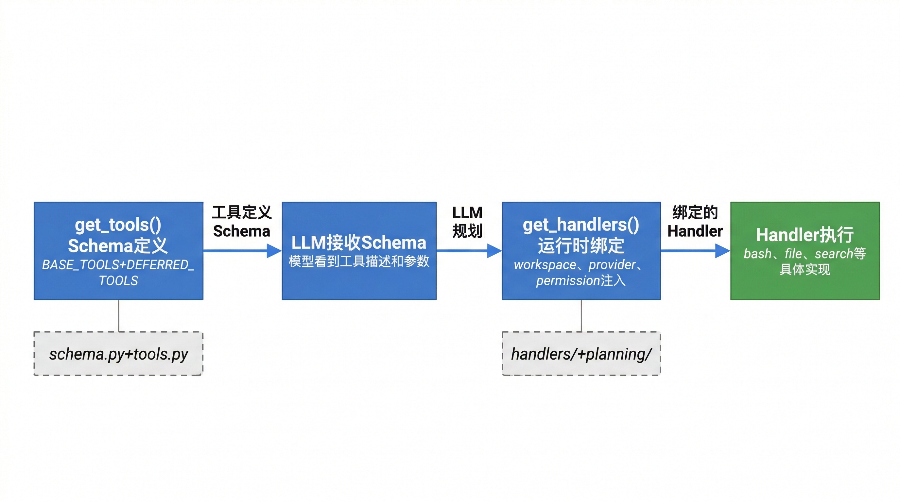

# 工具系统

BareAgent 的工具系统分成两层：

- `get_tools()`：向模型暴露“有哪些工具可用、每个工具接受什么参数”
- `get_handlers()`：在运行时把这些工具真正绑定成可执行的 Python 函数

从 `agent_loop()` 的视角看，流程是：

1. 把全部工具 schema 发给 LLM
2. 解析 LLM 返回的工具调用
3. 根据工具名从 handler 映射中找到对应实现
4. 执行并把结果写回消息历史



## 5.1 基础工具

基础工具由 `src/core/tools.py` 中的 `BASE_TOOLS` 定义，当前共有 6 个：

- `bash`
- `read_file`
- `write_file`
- `edit_file`
- `glob`
- `grep`

这些工具的实现位于 `src/core/handlers/`。

### 5.1.1 `bash`

| 项 | 说明 |
|----|------|
| 作用 | 在当前 workspace 中执行 shell 命令 |
| 参数 | `command`、`timeout=30` |
| 返回 | 合并后的 `stdout/stderr` 字符串 |

实现细节：

- Windows 下使用 `powershell -NoProfile -Command`
- 非 Windows 下使用 `bash -lc`
- 返回值总是字符串，不区分 stdout 和 stderr
- 超时时返回 `Error: command timed out after ...`
- 非零退出码返回 `Command failed with exit code ...`

在默认 `get_handlers(workspace=...)` 绑定下，命令工作目录会被固定为当前 workspace，而不是调用进程本身的 `cwd`。

### 5.1.2 `read_file`

| 项 | 说明 |
|----|------|
| 作用 | 读取 UTF-8 文本文件，并附带行号 |
| 参数 | `file_path`、`offset=0`、`limit=None` |
| 返回 | 多行字符串，每行形如 `12: line content` |

实现细节：

- `offset` 是从 0 开始的行偏移
- `limit` 是最多读取多少行
- 返回值中的行号从 1 开始显示
- 负数 `offset` 或 `limit` 会抛出 `ValueError`

### 5.1.3 `write_file`

| 项 | 说明 |
|----|------|
| 作用 | 写入文本文件 |
| 参数 | `file_path`、`content` |
| 返回 | 摘要字符串，例如 `Wrote 11 characters to nested/example.txt` |

实现细节：

- 如果父目录不存在，会自动创建
- 返回路径始终是 workspace 相对路径
- 当前实现是整文件覆盖写入，不支持 append

### 5.1.4 `edit_file`

| 项 | 说明 |
|----|------|
| 作用 | 精确替换文件中的已有文本 |
| 参数 | `file_path`、`old_text`、`new_text` |
| 返回 | 摘要字符串，例如 `Edited sample.txt` |

实现细节：

- 只替换第一次出现的 `old_text`
- 如果找不到 `old_text`，会抛出 `ValueError("old_text not found in file")`
- 这是文本级替换，不是 AST 级编辑

### 5.1.5 `glob`

| 项 | 说明 |
|----|------|
| 作用 | 在 workspace 中按 glob 模式查找文件 |
| 参数 | `pattern`、`path="."` |
| 返回 | `list[str]`，元素是 workspace 相对路径 |

实现细节：

- 返回结果会排序并去重
- `path` 可以指定搜索根目录，也可以直接指向某个文件
- 即使模式是 `*.py`，也会递归遍历子目录
- 默认会跳过 `.git`、`.pytest_cache`、`.venv`、`__pycache__`、`node_modules`
- 如果你显式把 `path` 指到这些目录内部，例如 `.venv`，工具会尊重这个显式选择并继续搜索

### 5.1.6 `grep`

| 项 | 说明 |
|----|------|
| 作用 | 用正则表达式搜索文件内容 |
| 参数 | `pattern`、`path="."`、`include=""` |
| 返回 | `list[str]`，元素形如 `src/main.py:12:matched line` |

实现细节：

- `pattern` 按 Python `re.compile()` 解释
- 如果正则非法，不会抛异常，而是返回单元素列表，例如 `["Invalid regex pattern: ..."]`
- `include` 是额外的 glob 过滤器，只对候选文件生效
- 超过 1 MB 的文件会被跳过
- 非 UTF-8 文件或无法读取的文件会被跳过
- 最多返回 1000 条匹配
- 与 `glob` 一样，默认也会跳过常见的缓存/依赖目录

### 路径沙箱约束

所有文件类和搜索类工具都会经过 `safe_path()` 检查，保证路径不能逃逸出 workspace。当前实现会拒绝：

- 绝对路径
- `~` 开头的 home 相对路径
- 通过 `..` 逃逸 workspace 的路径
- 路径链上的符号链接

这部分属于工具层的基本安全边界；更高层的确认策略见 [权限模型](./ch06-permission.md)。

## 5.2 延迟加载工具

`DEFERRED_TOOLS` 定义了第二组工具：

- `todo_write`
- `todo_read`
- `subagent`
- `load_skill`
- `task_create`
- `task_list`
- `task_get`
- `task_update`
- `background_run`
- `team_spawn`
- `team_send`
- `team_list`

这里的“延迟加载”需要准确理解：

- 工具 schema 从一开始就会出现在 `get_tools()` 的返回值里
- 延迟的是 manager/handler 的初始化和运行时绑定，而不是 schema 注册时机

### 5.2.1 `todo_write`

| 项 | 说明 |
|----|------|
| 作用 | 新建或更新当前会话的内存 TODO |
| 参数 | `action`，以及与 action 对应的字段 |
| 返回 | 状态字符串 |

参数规则：

- `action="add"` 时需要 `task`，可选 `priority`
- `action="update"` 时需要 `task_id` 和 `status`

支持的 TODO 状态为：

- `pending`
- `in_progress`
- `done`

TODO 数据只存在当前会话内存中，不会写入磁盘。

### 5.2.2 `todo_read`

| 项 | 说明 |
|----|------|
| 作用 | 列出当前会话内的 TODO |
| 参数 | 无 |
| 返回 | 文本列表；若为空则返回 `No TODO items.` |

返回是面向 LLM 的可读文本，而不是 JSON 数组。

### 5.2.3 `task_create`

| 项 | 说明 |
|----|------|
| 作用 | 创建持久化任务 |
| 参数 | `title`、`description=""`、`depends_on=[]` |
| 返回 | 任务字典 |

返回的任务对象包含：

- `id`
- `title`
- `description`
- `status`
- `depends_on`
- `created_at`
- `updated_at`

任务会持久化到 workspace 下的 `.tasks.json`。

### 5.2.4 `task_list`

| 项 | 说明 |
|----|------|
| 作用 | 列出持久化任务 |
| 参数 | 可选 `status` |
| 返回 | `list[task-dict]` |

支持的任务状态为：

- `pending`
- `in_progress`
- `done`
- `failed`

如果传入 `status`，只返回该状态下的任务。

### 5.2.5 `task_get`

| 项 | 说明 |
|----|------|
| 作用 | 读取单个持久化任务 |
| 参数 | `task_id` |
| 返回 | 单个任务字典 |

如果任务不存在，会抛出 `ValueError`。

### 5.2.6 `task_update`

| 项 | 说明 |
|----|------|
| 作用 | 更新任务状态和/或标题 |
| 参数 | `task_id`，可选 `status`、`title` |
| 返回 | 更新后的任务字典 |

虽然 schema 中 `status` 和 `title` 都是可选项，但 handler 实际要求至少提供其中一个；否则会抛出 `ValueError("status or title is required")`。

### 5.2.7 `subagent`

| 项 | 说明 |
|----|------|
| 作用 | 把一个自包含任务委派给子智能体 |
| 参数 | `task`、可选 `agent_type`、`run_in_background=false` |
| 返回 | 子智能体最终文本结果，或后台任务提交字符串 |

可选的内置 `agent_type` 为：

- `general-purpose`
- `explore`
- `plan`
- `code-review`

实现细节：

- 子智能体有独立消息列表，不复用父智能体历史
- 会根据 agent type 过滤工具集
- 会继承或降级权限模式
- 会受 `max_depth` 限制，超限时直接返回拒绝信息
- `run_in_background=true` 时会通过 `BackgroundManager` 异步运行

更完整的委派机制见 [子智能体系统](./ch09-subagent.md)。

### 5.2.8 `load_skill`

| 项 | 说明 |
|----|------|
| 作用 | 按名字加载某个技能目录下的 `SKILL.md` |
| 参数 | `skill_name` |
| 返回 | `SKILL.md` 的完整文本内容 |

技能目录默认按内置候选路径查找，也可以通过 `BAREAGENT_SKILLS_DIR` 覆盖。

### 5.2.9 `background_run`

| 项 | 说明 |
|----|------|
| 作用 | 把 shell 命令放到后台线程执行 |
| 参数 | `command`、`timeout=30`、可选 `task_id` |
| 返回 | 提交摘要字符串，例如 `Submitted background task job-1` |

实现细节：

- 如果未传 `task_id`，会自动生成一个随机 id
- 真正执行时仍然复用 `bash` 的命令运行逻辑
- 执行结果不会立刻出现在当前 tool result 中，而是稍后通过后台通知注入到消息历史
- 如果没有绑定 `BackgroundManager`，返回 `Background manager unavailable.`

### 5.2.10 `team_spawn`

| 项 | 说明 |
|----|------|
| 作用 | 启动一个已注册 teammate |
| 参数 | `name` |
| 返回 | 状态字符串 |

在完整 REPL 环境里，这会把一个已注册队友启动为后台自治智能体。若没有提供 team handlers，则使用默认 stub，返回“不可用”提示。

### 5.2.11 `team_send`

| 项 | 说明 |
|----|------|
| 作用 | 向某个 teammate 发送邮箱消息 |
| 参数 | `to_agent`、`content` |
| 返回 | 状态字符串 |

在完整 REPL 环境里，这会把消息写入 JSONL 邮箱，并由目标 agent 轮询处理。

### 5.2.12 `team_list`

| 项 | 说明 |
|----|------|
| 作用 | 列出当前已注册 teammate |
| 参数 | 无 |
| 返回 | `list[dict]` 或空列表 |

在主 REPL 中，返回项会包含队友元信息以及 `running` 状态；在未绑定 team handlers 的环境中，默认返回空列表。

## 5.3 工具 Schema 定义

BareAgent 向 LLM 暴露的工具描述统一遵循以下结构：

| 字段 | 说明 |
|------|------|
| `name` | 工具名 |
| `description` | 人类可读的用途描述 |
| `parameters` | JSON Schema object |

基础工具和多数延迟加载工具都通过 `src/core/schema.py` 中的 `tool_schema()` 生成：

```python
{
    "name": "...",
    "description": "...",
    "parameters": {
        "type": "object",
        "properties": {...},
        "required": [...]
    }
}
```

个别工具，例如 `subagent` 和 `load_skill`，虽然直接手写 schema 字典，但最终结构与上面一致，因此 provider 层可以把它们统一转换成 Anthropic/OpenAI 所需的 tool 定义。

## 5.4 工具处理器

工具处理器的职责不是“声明接口”，而是“把运行时依赖绑定成真正可执行的函数”。

### 处理器来源

| 来源模块 | 负责的工具 |
|----------|------------|
| `src/core/handlers/bash.py` | `bash` |
| `src/core/handlers/file_read.py` | `read_file` |
| `src/core/handlers/file_write.py` | `write_file` |
| `src/core/handlers/file_edit.py` | `edit_file` |
| `src/core/handlers/glob_search.py` | `glob` |
| `src/core/handlers/grep_search.py` | `grep` |
| `src/planning/todo.py` | `todo_write`、`todo_read` |
| `src/planning/tasks.py` | `task_*` |
| `src/planning/skills.py` | `load_skill` |
| `src/planning/subagent.py` | `subagent` |
| `src/core/tools.py` | `background_run`、`team_*` 的运行时绑定 |

### `get_handlers()` 的作用

`get_handlers(workspace, ...)` 会把以下运行时对象绑定进 handler：

- workspace 路径
- `TodoManager`
- `TaskManager`
- `SkillLoader`
- provider
- permission guard
- `BackgroundManager`
- team handlers
- subagent 相关系统提示和深度配置

因此，同一个工具 schema 在不同运行环境下，可能绑定出不同能力的 handler。例如：

- 没有 provider 时，`subagent` 会退化为“不可用”提示
- 没有 `BackgroundManager` 时，`background_run` 也会退化为“不可用”提示
- 没有 team handlers 时，`team_*` 会使用默认 stub

### `TOOL_HANDLERS` 与默认 stub

`src/core/tools.py` 里还定义了一个模块级 `TOOL_HANDLERS`。它的作用更接近“占位注册表”：

- 文件与 shell 工具在这里默认是未绑定 stub
- 直接调用这些 stub 会提示“请用 `get_handlers()` 绑定 workspace”
- 真正供 REPL 和 `agent_loop()` 使用的，仍然是 `get_handlers()` 返回的 handler 映射

这也是为什么文档和测试都以 `get_tools()` + `get_handlers()` 作为主要集成入口，而不是直接依赖模块级常量。

## 小结

BareAgent 的工具系统可以概括为三句话：

1. `get_tools()` 负责把工具接口完整暴露给模型
2. `get_handlers()` 负责把这些接口绑定成当前运行时可执行的函数
3. “延迟加载工具”延迟的是初始化和绑定，不是 schema 的可见性

下一章将继续介绍这些工具在执行前如何经过权限守卫过滤，以及不同模式下哪些调用会被自动放行、阻止或要求确认。
