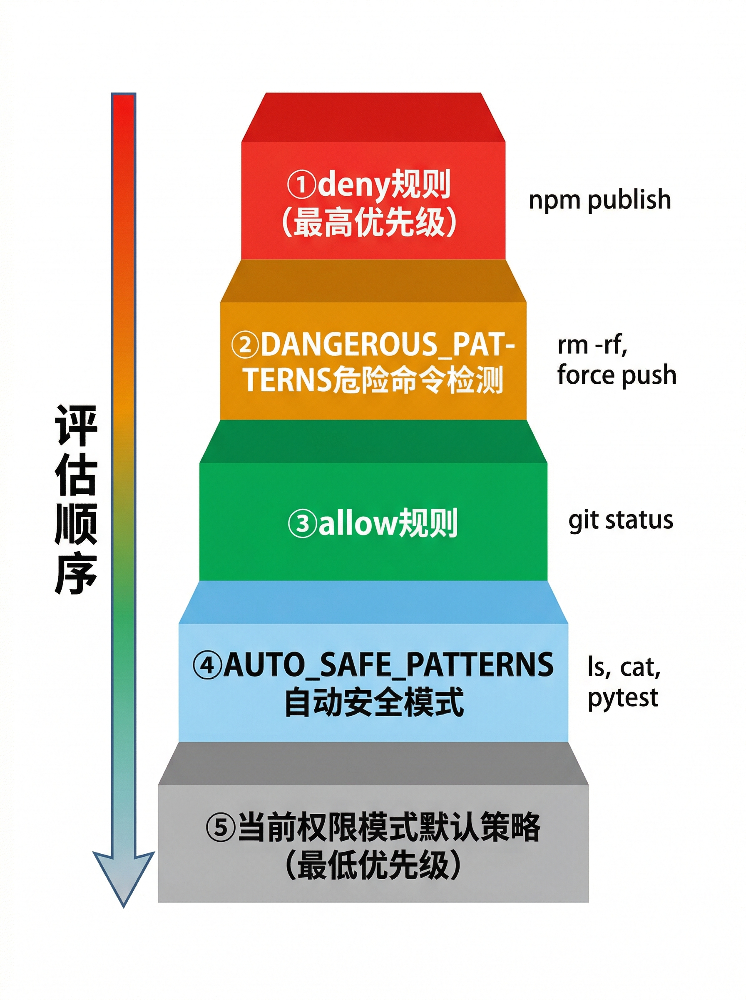

# 权限模型

BareAgent 的权限系统由 `src/permission/guard.py` 中的 `PermissionGuard` 负责。它不直接决定“工具能不能存在”，而是决定“当模型发起某个工具调用时，是否需要人工确认，以及在无法确认时是否直接拒绝”。

从 `agent_loop()` 的视角看，权限检查发生在“模型已经决定要调用某个工具”之后、真正执行 handler 之前：

1. LLM 返回 `tool_calls`
2. `PermissionGuard.requires_confirm()` 判断是否需要确认
3. 如果需要，再调用 `ask_user()`
4. 允许则执行 handler；拒绝则把 `User denied.` 作为错误型 `tool_result` 写回历史

这意味着权限模型是运行时守卫，而不是编译期白名单。

## 6.1 四种权限模式

权限模式由 `PermissionMode` 枚举定义，取值为：

- `default`
- `auto`
- `plan`
- `bypass`

它们的核心差异如下。

| 模式 | 总体行为 | `bash` | 文件写入/编辑 | 其他非安全工具 |
|------|----------|--------|---------------|----------------|
| `DEFAULT` | 保守模式 | 安全命令可自动放行，其余大多要确认 | `write_file` 需确认；`edit_file` 自动放行 | 大多需要确认 |
| `AUTO` | 自动化优先 | 非危险命令默认放行 | `write_file` 自动放行；`edit_file` 自动放行 | 大多仍需确认 |
| `PLAN` | 只读守卫 | 仅 `SAFE_TOOLS` 自动放行 | 被阻止 | 被阻止 |
| `BYPASS` | 完全跳过确认 | 全部放行 | 全部放行 | 全部放行 |

需要特别注意两个实现细节：

### `edit_file`、`task_create`、`task_update` 的特例

在当前实现中，只要不是 `PLAN` 或 `BYPASS` 的早期返回路径，下面三个工具都不会要求确认：

- `edit_file`
- `task_create`
- `task_update`

这意味着：

- `DEFAULT` 下 `write_file` 比 `edit_file` 更严格
- `AUTO` 下 `task_create` / `task_update` 不会再额外弹确认

### `PLAN` 不是“绝对无副作用”

`PLAN` 模式的判断标准是“是否属于 `SAFE_TOOLS`”，而不是抽象意义上的完全纯函数。当前 `SAFE_TOOLS` 中包含 `todo_write`，它会修改当前会话的内存 TODO。

因此，`PLAN` 更准确的理解是：

- 禁止文件修改、shell 执行和多数高风险工具
- 允许少量被认为足够安全的只读或会话级工具

## 6.2 安全工具白名单

`PermissionGuard.SAFE_TOOLS` 当前包含以下工具：

| 工具 | 作用 |
|------|------|
| `read_file` | 读取文本文件 |
| `glob` | 搜索文件路径 |
| `grep` | 搜索文件内容 |
| `todo_read` | 读取会话 TODO |
| `todo_write` | 更新会话内存 TODO |
| `load_skill` | 读取技能文档 |
| `task_list` | 列出持久化任务 |
| `task_get` | 读取单个持久化任务 |
| `team_list` | 列出已注册 teammate |

白名单的影响有两层：

1. 在 `DEFAULT` / `AUTO` 下，这些工具直接放行
2. 在 `PLAN` 下，只有这些工具会被允许执行

反过来说，以下工具虽然经常被理解为“轻量操作”，但并不在安全白名单中：

- `task_create`
- `task_update`
- `subagent`
- `team_send`
- `background_run`
- `write_file`
- `edit_file`
- `bash`

## 6.3 自动安全模式

`AUTO_SAFE_PATTERNS` 是一组正则表达式，用来识别可以自动批准的 `bash` 命令。当前模式包括：

| 模式类别 | 当前匹配 |
|----------|----------|
| 基础查看命令 | `ls`、`cat`、`head`、`tail`、`wc`、`echo`、`pwd`、`date`、`which`、`type` |
| Git 只读命令 | `git status`、`git log`、`git diff`、`git branch`、`git show` |
| 常见检查命令 | `pytest`、`python -m pytest`、`ruff`、`mypy` |
| Node 检查命令 | `npm test`、`npm run lint`、`npm run test` |

判断顺序不是“只要在 AUTO 就全都自动放行”，而是：

1. 先看 `deny` 规则
2. 再看危险命令模式
3. 再看 `allow` 规则
4. 再看自动安全模式
5. 最后才根据当前权限模式兜底

因此在 `DEFAULT` 下，`git status` 也可以无需确认；在 `AUTO` 下，`pytest tests/test_loop.py` 也会自动放行。

## 6.4 危险命令检测

`DANGEROUS_PATTERNS` 是另一组正则，用来识别即使在 `AUTO` 模式下也必须拦截的高风险命令。当前覆盖的几类场景包括：

| 类别 | 例子 |
|------|------|
| 明显破坏性删除 | `rm -rf` |
| 高风险 Git 操作 | `git push --force`、`git reset --hard` |
| 数据库破坏语句 | `DROP TABLE`、`DELETE FROM` |
| shell wrapper 绕过 | `bash -c`、`sh -c`、`zsh -c` 等 |
| 绝对路径 `rm` 绕过 | `/bin/rm`、`/usr/bin/rm` |
| `env` 前缀绕过 | `env ...` |
| 下载后管道执行 | `curl ... | bash`、`wget ... | sh` |
| 破坏性系统命令 | `chmod 777`、`mkfs`、`dd if=`、`find ... -delete` |

这组规则的优先级高于 `allow` 规则。也就是说，即使你写了：

```toml
[permission]
allow = ["bash(prefix:rm*)"]
```

像 `rm -rf build` 这样的命令依然会被判定为需要确认，无法通过 allow 规则绕过。

## 6.5 Allow/Deny 规则

配置文件中的 `allow` 和 `deny` 会被解析成前缀匹配规则。目前只参与 `bash` 的确认逻辑。

### 规则语法

规则格式为：

```text
tool_name(prefix:command-prefix*)
```

例如：

```toml
[permission]
allow = [
  "bash(prefix:git status*)",
  "Bash(prefix:pytest tests/*)"
]
deny = [
  "bash(prefix:npm publish*)"
]
```

### 匹配方式

当前实现使用 `_parse_prefix_rule()` 解析规则，并按以下方式匹配：

- 工具名会被规范化为小写，所以 `Bash(...)` 和 `bash(...)` 等价
- 末尾的 `*` 会被裁掉，实际含义是“字符串前缀匹配”
- 匹配的是 `cmd.strip().startswith(prefix)`，不是完整 glob，也不是正则
- 无法解析的规则会被静默忽略

### 优先级

对于 `bash`，完整优先级是：

1. `deny`
2. `DANGEROUS_PATTERNS`
3. `allow`
4. `AUTO_SAFE_PATTERNS`
5. 当前模式默认策略



因此可以把它理解为：

- `deny` 是最强的手工拦截
- `allow` 只负责放宽非危险命令
- 危险模式属于全局 fail-closed 规则

## 6.6 运行时模式切换

权限模式可以在 REPL 里动态切换，不需要重启进程。

### 斜杠命令

BareAgent 内置四个直接切换命令：

- `/default`
- `/auto`
- `/plan`
- `/bypass`

另外还有 `/mode` 交互式菜单，它会在下一次输入中读取 `1` 到 `4` 作为选择结果。

这些命令的具体交互方式见 [REPL 交互](./ch04-repl.md)。

### `Shift+Tab`

在启用了 `prompt_toolkit` 的 TTY REPL 中，`Shift+Tab` 会按固定顺序循环切换：

```text
default -> auto -> plan -> bypass -> default
```

切换时不会清空当前已经输入到一半的 prompt buffer。

## 6.7 Fail-closed 机制

`PermissionGuard.ask_user()` 只有在“能真正向用户提问”的前提下才会返回 `True`。以下情况会直接拒绝：

- `fail_closed=True`
- 当前模式为 `PLAN`
- 当前环境不是交互式 TTY
- 读取用户输入时遇到 `EOFError`

也就是说，BareAgent 在“无法可靠确认”时会偏向拒绝，而不是默认放行。

### 子智能体和后台场景

`PermissionGuard.for_subagent()` 会为子智能体克隆一份新 guard，并复制原有的 `allow_rules` / `deny_rules`。当前实现的规则是：

- 如果 `AgentType` 显式指定了 `permission_mode`，子智能体使用该模式
- 否则直接继承父级模式
- 如果是后台子智能体，或者最终模式是 `PLAN`，则自动打开 `fail_closed`

这里有一个容易误解的点：

- 当前代码不会自动把父级 `AUTO` 降级成 `DEFAULT`
- 是否降级完全取决于 `AgentType.permission_mode`

例如：

- `general-purpose` 默认继承父级模式
- `explore` / `plan` / `code-review` 明确指定为 `PLAN`

### 后台与自治队友

后台任务、后台子智能体以及 `/team spawn` 启动的自治 teammate 都没有可靠的人机确认通道。因此这些执行路径都会显式使用 `fail_closed`，一旦遇到需要确认的工具调用，就会直接得到拒绝型 `tool_result`。

## 小结

BareAgent 的权限模型可以概括成三条：

1. `SAFE_TOOLS` 决定了哪些调用可以天然放行，尤其决定了 `PLAN` 模式的边界
2. `bash` 额外叠加了 allow/deny、自动安全模式和危险命令检测
3. 在后台、子智能体或非交互环境中，系统会优先选择 fail-closed，而不是偷偷放行

下一章会继续介绍被权限系统守护的另一侧：LLM provider 抽象，以及 BareAgent 如何把 Anthropic、OpenAI 和 DeepSeek 统一成相同的响应结构。
