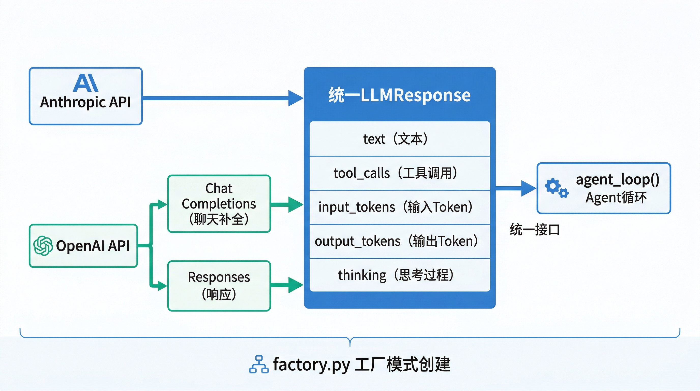

# LLM 提供商

BareAgent 的 provider 层负责把“统一的消息历史和工具 schema”转换成具体厂商 API 请求，再把原始响应归一化成同一套 `LLMResponse` 结构。

这一层的目标不是隐藏所有差异，而是把上层真正关心的东西稳定下来：

- 文本输出
- 工具调用
- token 计数
- 流式事件
- 可选的思考内容

因此 `agent_loop()` 可以只依赖抽象接口，不必理解 Anthropic 和 OpenAI 的细节差异。下一章会看到这一点如何在主循环里落地。

## 7.1 抽象基类 BaseLLMProvider

统一抽象定义在 `src/provider/base.py`。

### 核心数据结构

| 类型 | 作用 | 关键字段 |
|------|------|----------|
| `ThinkingConfig` | 扩展思考配置 | `mode`、`budget_tokens` |
| `ToolCall` | 归一化后的工具调用 | `id`、`name`、`input` |
| `StreamEvent` | 流式增量事件 | `type`、`text`、`tool_call_id`、`name`、`input` |
| `LLMResponse` | 统一响应结构 | `text`、`stop_reason`、`input_tokens`、`output_tokens`、`tool_calls`、`thinking`、`content_blocks` |

### `ThinkingConfig`

`ThinkingConfig` 默认值如下：

| 字段 | 默认值 |
|------|--------|
| `mode` | `adaptive` |
| `budget_tokens` | `10000` |

当前允许的模式为：

- `enabled`
- `adaptive`
- `disabled`

### `LLMResponse`

`LLMResponse` 是 provider 层最重要的归一化对象。

| 字段 | 含义 |
|------|------|
| `text` | 助手文本输出 |
| `stop_reason` | 厂商原始终止原因或归一化终止原因 |
| `input_tokens` | 输入 token 数 |
| `output_tokens` | 输出 token 数 |
| `tool_calls` | 归一化后的工具调用列表 |
| `thinking` | 提取后的思考文本 |
| `content_blocks` | 更细粒度的块结构，用于保留 thinking / tool_use 等内容 |

`LLMResponse.has_tool_calls` 用于快速判断这一轮是否要进入工具分发。

`LLMResponse.to_message()` 会把归一化响应重新还原成消息历史中的 assistant message：

- 如果存在 `content_blocks`，优先按块结构回放
- 如果没有 `content_blocks` 且没有工具调用，退化为普通文本消息
- 如果有工具调用，则拼成 `text + tool_use` block 列表

### `BaseLLMProvider`

所有 provider 都必须实现两个接口：

```python
def create(messages, tools, **kwargs) -> LLMResponse
def create_stream(messages, tools, **kwargs) -> Generator[StreamEvent, None, LLMResponse]
```

上层只关心这两个调用：

- 非流式路径调用 `create()`
- 流式路径调用 `create_stream()`

## 7.2 AnthropicProvider

`AnthropicProvider` 位于 `src/provider/anthropic.py`，是对 `anthropic.Anthropic` 客户端的轻量封装。

### 请求构造

在 Anthropic 路径下，BareAgent 会先把消息和工具转换成 Claude Messages API 所需格式：

- 所有 `system` 消息会合并成一个 `system` 字符串
- 其他消息保留为 `messages`
- 工具 schema 会转成 `tools[*].input_schema`

转换后的工具结构大致如下：

```python
{
    "name": "...",
    "description": "...",
    "input_schema": {
        "type": "object",
        "properties": {...}
    }
}
```

### Thinking 参数

Anthropic 路径是当前唯一实际消费 `ThinkingConfig` 的 provider。

当 `mode` 为 `enabled` 或 `adaptive` 时：

- 请求里会附带 `thinking = {"type": ..., "budget_tokens": ...}`
- `max_tokens` 会被抬高到至少 `budget_tokens + 1`

这意味着如果你在配置里写了 `[thinking]`，它会真实影响 Claude 请求。

### 消息块转换

`AnthropicProvider` 会保留并转换以下 block：

- `text`
- `tool_use`
- `tool_result`
- `thinking`
- `redacted_thinking`

因此它不仅能提取工具调用，还能把 thinking block 作为 `content_blocks` 保留下来，供后续 `to_message()` 重建。

### 流式输出

`create_stream()` 会消费 `client.messages.stream(...)`，并把原始事件转换成两类 `StreamEvent`：

- 文本增量：`StreamEvent(type="text", text=...)`
- 工具调用：`StreamEvent(type="tool_call", tool_call_id=..., name=..., input=...)`

当前实现只有在收到 `content_block_stop` 且该 block 为 `tool_use` 时，才产出工具调用事件。

## 7.3 OpenAIProvider

`OpenAIProvider` 位于 `src/provider/openai.py`。它除了支持官方 OpenAI API，也被用来承载 DeepSeek 这类 OpenAI 兼容接口。

### `wire_api`

当前 `OpenAIProvider` 支持两条传输路径：

- `chat_completions`
- `responses`

如果未显式配置，默认值是：

```text
chat_completions
```

当 `wire_api == "responses"` 时，会改走 Responses API，并使用另一套消息与工具转换逻辑。

### Chat Completions 路径

在 `chat_completions` 路径下：

- 用户和系统消息会转成传统 chat messages
- assistant 的 `tool_use` 会转成 `tool_calls`
- user 侧的 `tool_result` 会转成 `role="tool"` 消息

工具 schema 会转成：

```python
{
    "type": "function",
    "function": {
        "name": "...",
        "description": "...",
        "parameters": {...}
    }
}
```

### Responses 路径

在 `responses` 路径下，BareAgent 会使用不同的 wire shape：

- `system` / `developer` 消息会被合并成 `instructions`
- `user` / `assistant` 会变成 `input` 数组里的 message item
- `tool_result` 会变成 `function_call_output`
- `tool_use` 会变成 `function_call`

工具定义也会变成 Responses API 风格：

```python
{
    "type": "function",
    "name": "...",
    "description": "...",
    "parameters": {...},
    "strict": False
}
```

### 工具参数解析

OpenAI 路径里的工具参数最终都通过 JSON 解析。如果原始 `arguments` 不是合法 JSON：

- 会退化成 `{"raw_arguments": "..."}`
- 如果 JSON 根节点不是对象，则再包成 `{"value": ...}`

这能避免因为厂商返回了“不是对象”的参数而让主循环直接崩掉。

## 7.4 工厂模式

provider 的统一入口是 `src/provider/factory.py` 中的 `create_provider(config)`。

当前支持的 provider 名称如下：

| `provider.name` | 实际实例 |
|-----------------|----------|
| `anthropic` | `AnthropicProvider` |
| `openai` | `OpenAIProvider` |
| `deepseek` | `OpenAIProvider` |

### API Key 读取

`create_provider()` 不直接接收 API Key 文本，而是：

1. 读取 `config.provider.api_key_env`
2. 去环境变量中找真正的密钥
3. 若缺失则直接报错

因此配置文件里存的是“变量名”，不是“变量值”。

### DeepSeek 的处理方式

`deepseek` 当前并没有单独的 provider 类，而是直接复用 `OpenAIProvider`：

- `base_url` 未设置时默认使用 `https://api.deepseek.com`
- 其余消息和工具转换逻辑与 OpenAI 兼容路径相同

## 7.5 LLMResponse 统一响应结构

BareAgent 对上层暴露的不是厂商原始响应，而是归一化后的 `LLMResponse`。

这样做的直接收益是：

- `agent_loop()` 不必区分 Anthropic 的 `tool_use` 和 OpenAI 的 `tool_calls`
- UI 层只要处理 `text` 与 `StreamEvent`
- 压缩器只要依赖 `provider.create()` 的普通文本总结能力



### 统一后的工具调用

无论底层来自：

- Anthropic `tool_use`
- OpenAI Chat `tool_calls`
- OpenAI Responses `function_call`

上层看到的都是：

```python
ToolCall(id="...", name="...", input={...})
```

### 统一后的 token 字段

`LLMResponse` 不再保留厂商原始 `usage` 对象，而是归一化为：

- `input_tokens`
- `output_tokens`

这让压缩、日志和调试代码不需要知道每家 SDK 的字段名差异。

## 7.6 流式 vs 非流式

两条调用路径的公共目标是一致的：都返回最终 `LLMResponse`。差异在于流式路径还会额外产出一串 `StreamEvent`。

### 非流式

非流式路径最直接：

- Anthropic: `client.messages.create(...)`
- OpenAI Chat: `client.chat.completions.create(...)`
- OpenAI Responses: `client.responses.create(...)`

### 流式

流式路径下，BareAgent 会把厂商的增量事件规整成：

- `text`
- `tool_call`

OpenAI 的两条 wire path 细节不同：

#### Chat Completions 流式

- 文本来自 `delta.content`
- 工具调用通过增量拼接 `delta.tool_calls[*].function.arguments`
- 即使最终 `finish_reason` 不是 `tool_calls`，只要已经拼出了完整工具参数，仍会在收尾阶段补发工具调用事件

#### Responses 流式

- 文本来自 `response.output_text.delta`
- 工具调用来自 `response.output_item.done`
- 最终完成事件 `response.completed` 会携带完整响应，用来生成收尾的 `LLMResponse`

### 官方 OpenAI Host 的小差异

在 `chat_completions` 流式模式下，如果目标 host 是官方 `api.openai.com`，BareAgent 会自动附带：

```python
stream_options={"include_usage": True}
```

自定义 `base_url` 不满足这个条件时，不会自动加上这项参数。

## 7.7 扩展思考

扩展思考配置由 `ThinkingConfig` 表示，但当前生效范围需要区分 provider：

| Provider | 是否消费 `ThinkingConfig` | 说明 |
|----------|--------------------------|------|
| `AnthropicProvider` | 是 | 会生成 `thinking` 请求参数，并影响 `max_tokens` |
| `OpenAIProvider` | 否 | 当前不会直接读取 `ThinkingConfig` |
| `deepseek` | 否 | 走 `OpenAIProvider` 路径，因此同样不直接消费 |

这也是为什么配置章节里会强调：

- `[thinking]` 是全局配置项
- 但并不是所有 provider 都会使用它

## 小结

BareAgent provider 层做了两件关键事情：

1. 把 Anthropic、OpenAI、DeepSeek 的消息格式和工具格式转换成各自 API 需要的请求
2. 再把厂商响应统一压成 `LLMResponse` 和 `StreamEvent`

有了这层抽象以后，主循环就可以专注于“什么时候调用模型、什么时候执行工具、什么时候结束迭代”。下一章将进入这条真正的执行主线。
