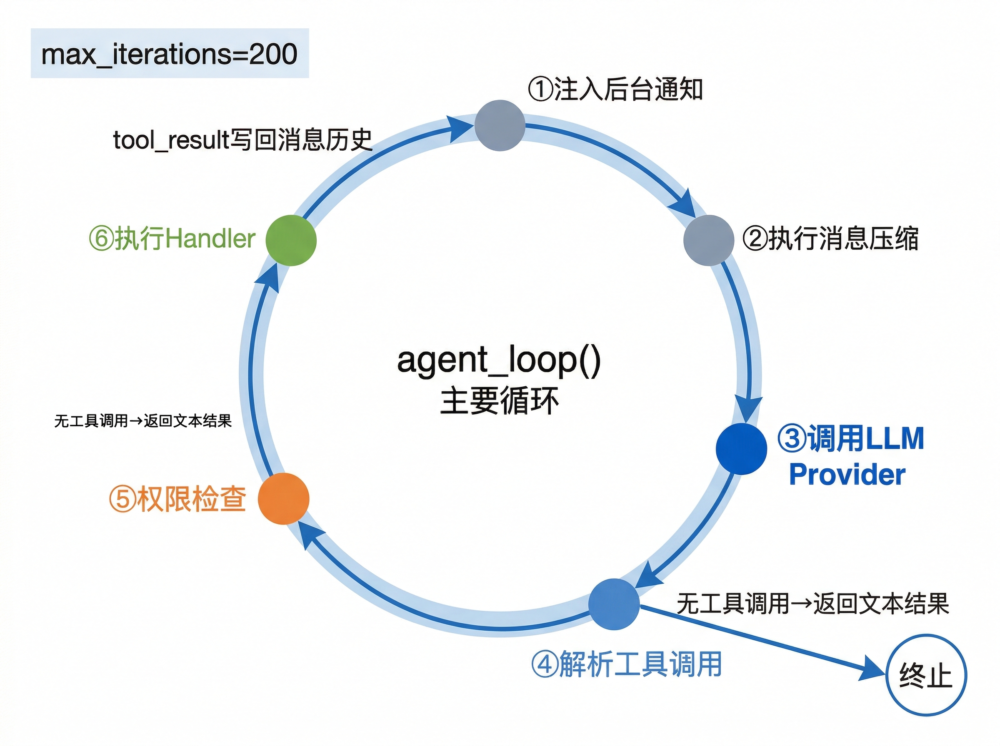
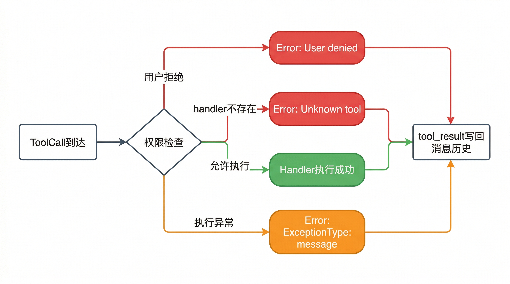

# 核心智能体循环

`src/core/loop.py` 中的 `agent_loop()` 是 BareAgent 的执行核心。它把 provider、工具 schema、运行时 handler、权限守卫、压缩器和后台通知串成一条完整闭环。

如果把前几章连起来看，可以把它理解为：

- provider 负责“模型怎么说”
- tools / handlers 负责“工具怎么做”
- permission 负责“做之前要不要确认”
- `agent_loop()` 负责“把这几件事按正确顺序接起来”

## 8.1 `agent_loop()` 执行流程

当前实现的主循环顺序是固定的。每一轮迭代大致如下：

1. 调用 `_run_background()`，把已完成后台任务的通知注入消息历史
2. 调用 `compact_fn(messages)`，执行微压缩或完整压缩
3. 调用 provider，得到 `LLMResponse` 或流式事件
4. 把 `response.to_message()` 追加到消息历史
5. 如果模型没有工具调用，直接返回本轮文本结果
6. 否则依次处理每个 `ToolCall`
7. 对每个工具调用先做权限检查，再执行 handler
8. 把工具输出包装成 `tool_result` block，作为一条 `role="user"` 消息追加
9. 进入下一轮，让模型看到刚刚产生的工具结果

这也是 BareAgent 的基本回路：

```text
LLM -> tool_calls -> permission -> handlers -> tool_result -> LLM
```



### 一轮典型交互

下面是一次典型工具回合在消息历史中的形态：

```python
{"role": "assistant", "content": [
    {"type": "text", "text": "我先读一下配置。"},
    {"type": "tool_use", "id": "toolu_1", "name": "read_file", "input": {"file_path": "config.toml"}}
]}

{"role": "user", "content": [
    {"type": "tool_result", "tool_use_id": "toolu_1", "content": "1: [provider]\n2: ..."}
]}
```

下一轮 provider 调用时，模型看到的就是这两条消息。

### 失败不会直接打断回路

如果 handler 抛出异常，`agent_loop()` 不会立刻终止，而是把异常转换成：

```text
Error: <ExceptionType>: <message>
```

再作为错误型 `tool_result` 写回消息历史，让模型自己决定是否重试、换工具或结束。

## 8.2 迭代控制

`agent_loop()` 通过 `max_iterations` 控制最大回合数，默认值为：

```text
200
```

如果模型持续返回工具调用，导致循环一直不结束，最终会抛出：

```text
LLMCallError("Agent loop exceeded <n> iterations")
```

这是一道硬保护，避免坏 prompt、错误工具结果或模型异常行为导致无限循环。

### 子智能体的回合上限

主 REPL 默认使用 `200`，但子智能体会根据 `AgentType.max_turns` 覆盖这个值。详见 [子智能体系统](./ch09-subagent.md)。

## 8.3 工具调用解析与分发

`agent_loop()` 本身不解析厂商原始响应，它只依赖 provider 层给出的 `LLMResponse.tool_calls`。

也就是说，上层看到的永远是：

```python
ToolCall(
    id="...",
    name="...",
    input={...},
)
```

### 分发顺序

对每个 `ToolCall`，循环按以下顺序处理：

1. 如果 UI 尚未显示过该工具调用，先打印工具名和参数
2. 调用 `permission.requires_confirm()`
3. 如需确认，则调用 `permission.ask_user()`
4. 在 `handlers` 映射里按 `call.name` 查找对应 handler
5. 执行 handler，并收集输出

### 三种常见分支

| 情况 | 结果 |
|------|------|
| 用户拒绝 / fail-closed 拒绝 | 生成 `User denied.` 的错误型 `tool_result` |
| handler 不存在 | 生成 `Unknown tool: <name>` 的错误型 `tool_result` |
| handler 执行异常 | 生成 `Error: <type>: <message>` 的错误型 `tool_result` |



### 工具结果格式

工具结果统一由 `_tool_result()` 构造。输出会先经过 `_stringify_output()`：

- 字符串原样保留
- `None` 变成空字符串
- 其他对象用 JSON 序列化

最终块结构如下：

```python
{
    "type": "tool_result",
    "tool_use_id": "...",
    "content": "...",
    "is_error": True | False,
}
```

## 8.4 流式输出集成

当 `stream=True` 时，`agent_loop()` 不直接调用 `provider.create()`，而是进入 `_invoke_provider()`。

### 流式路径

流式执行会：

1. 调用 `provider.create_stream(...)`
2. 用 `StreamPrinter` 实时打印文本
3. 在收到 `tool_call` 事件时先结束当前文本流，再打印工具调用信息
4. 等流结束后拿到最终 `LLMResponse`

这样 UI 既能边打字边显示回答，也能在模型决定调工具时及时把工具信息插出来。

### 回退到非流式的条件

BareAgent 不会对所有流式异常都自动重试。当前只有一种情况会回退到非流式：

- streaming 在“尚未产生任何事件”之前，就以 `NotImplementedError` 形式表明不支持

如果满足这个条件，控制流会退回到普通 `provider.create(...)`，并打印一条状态提示。

### 不会回退的情况

以下情况不会自动回退：

- 流式过程中已经输出过部分文本，随后连接出错
- provider 抛出的是 `RuntimeError` 等普通运行时异常
- 中途断流但不是“明确不支持 streaming”

这些情况都会被包装成 `LLMCallError` 继续向外抛出。

### 文本输出去重

如果本轮已经通过流式事件打印过文本，`agent_loop()` 在追加最终 `response.to_message()` 后，不会再重复打印一次 `response.text`。

## 8.5 后台任务注入

每轮迭代一开始，`agent_loop()` 都会调用 `_run_background(bg_manager, messages)`。这一步的作用不是“执行后台任务”，而是：

- 从 `BackgroundManager.drain_notifications()` 拉取已经完成的结果
- 通过 `inject_notifications()` 把这些结果注入消息历史

### 注入形式

后台通知会被包装成一条 `role="system"` 消息，内容形如：

```text
<background-notifications>
后台任务更新：
- Task job-1: done - ...
</background-notifications>
```

### 插入位置

如果当前消息列表的最后一条是普通用户消息，通知不会简单地 append 到最后，而是插入到这条用户消息之前。这样可以避免把“真实用户问题”和“后台状态回报”颠倒顺序。

如果最后一条用户消息本身是 `tool_result`，则通知会直接追加到末尾，保持工具回合结构完整。

### 和 `background_run` 的关系

`background_run` 工具只负责提交后台任务。真正把结果送回模型视野的，是下一轮 `agent_loop()` 开始时的这一步注入逻辑。

后台执行与通知机制的具体实现见 [后台执行](./ch14-background.md)。

## 8.6 何时结束

主循环只有两种正常终止方式：

1. 模型返回了不带工具调用的 `LLMResponse`
2. 达到 `max_iterations` 并抛出 `LLMCallError`

除此之外，provider 调用失败也会抛出 `LLMCallError`。错误信息格式统一为：

```text
LLM call failed: <ExceptionType>: <message>
```

### 一个容易忽略的点

`agent_loop()` 的返回值只是“最后一轮 assistant 的文本输出”。它不会直接返回整段消息历史，也不会把工具输出拼成最终字符串。

真正完整的会话上下文始终保留在传入的 `messages` 列表里。

## 小结

`agent_loop()` 的职责不是做复杂推理，而是稳定地维护这条执行回路：

1. 让模型看见最新消息和工具结果
2. 按权限规则执行模型要求的工具
3. 把结果再喂回模型
4. 在需要时处理流式输出、压缩和后台通知

下一章会在这条主循环之上再加一层：当工具本身是 `subagent` 时，BareAgent 如何创建一个受限、隔离、可递归控制的子智能体。
