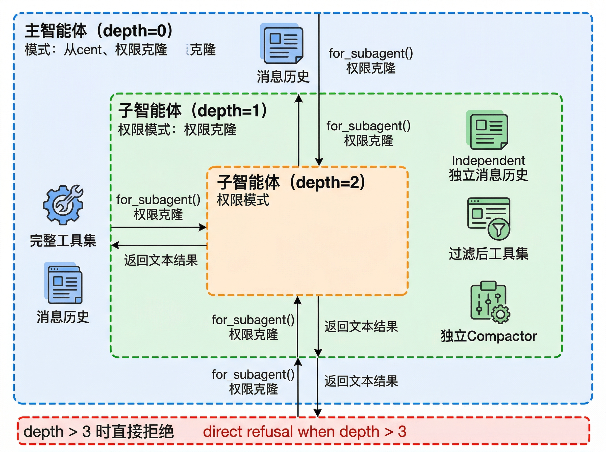

# 子智能体系统

BareAgent 的 `subagent` 工具允许主智能体把一个相对自包含的任务委派给子智能体执行。实现入口位于 `src/planning/subagent.py`，而子智能体的行为轮廓由 `src/planning/agent_types.py` 里的 `AgentType` 定义。

这一层的设计重点不是“复制一个完整主 REPL”，而是：

- 给子任务一个独立消息历史
- 对工具集做裁剪
- 对权限模式做隔离
- 控制嵌套深度和回合数
- 在上下文过长时独立压缩

## 9.1 智能体类型系统

`AgentType` 是一个冻结数据类，定义了某类子智能体的行为边界。

| 字段 | 作用 |
|------|------|
| `name` | 类型名 |
| `description` | 面向模型和用户的简短描述 |
| `system_prompt` | 附加系统提示 |
| `tools` | 可选白名单；若为 `None`，表示默认继承全部工具 schema |
| `disallowed_tools` | 可选黑名单 |
| `max_turns` | 该类型子智能体的最大 agent loop 回合数 |
| `allow_nesting` | 是否允许继续调用 `subagent` |
| `permission_mode` | 可选权限模式覆盖 |

当前的过滤逻辑由两个函数实现：

- `filter_tools()`：过滤 schema
- `filter_handlers()`：让 handler 集合与过滤后的 schema 保持一致

## 9.2 内置类型

当前内置四种子智能体类型：

| 类型 | 最大回合 | 可嵌套 | 权限模式 | 当前定位 |
|------|----------|--------|----------|----------|
| `general-purpose` | `200` | 是 | 继承父级 | 通用委派 |
| `explore` | `50` | 否 | `PLAN` | 代码探索 |
| `plan` | `50` | 否 | `PLAN` | 方案设计 |
| `code-review` | `50` | 否 | `PLAN` | 代码审查 |

后三者共享一组“只读默认值”：

- `disallowed_tools = ["write_file", "edit_file", "bash", "subagent"]`
- `max_turns = 50`
- `allow_nesting = False`
- `permission_mode = PermissionMode.PLAN`

### “只读”类型的真实边界

这里有一个很重要的实现细节：内置只读类型并没有把工具 schema 缩成一个极小白名单，而是只显式移除了四个工具：

- `write_file`
- `edit_file`
- `bash`
- `subagent`

其他潜在高风险工具，例如：

- `task_create`
- `task_update`
- `team_send`
- `background_run`

在 schema 层面仍可能保留，但由于这些类型同时把权限模式设成了 `PLAN`，真正执行时仍会被权限守卫拒绝。

因此“只读”是两层机制共同作用的结果：

1. 工具过滤先移除一批明显不该出现的工具
2. `PLAN` 权限再拦截剩余的高风险调用

## 9.3 工具过滤

子智能体创建时，`run_subagent()` 会先解析出 `resolved_type`，然后对工具和 handler 做过滤。

### `filter_tools()`

过滤顺序可以理解为：

1. 如果 `tools` 白名单存在，只保留白名单中的工具
2. 如果 `disallowed_tools` 黑名单存在，移除这些工具
3. 如果 `allow_nesting=False`，无论前两步结果如何，都再额外移除 `subagent`

### `filter_handlers()`

handler 过滤更简单：只保留那些在过滤后 schema 里仍然存在同名工具的 handler。

### 嵌套控制

当 `allow_nesting=False` 时，即使你没有把 `subagent` 写进黑名单，`filter_tools()` 也会主动把它移除。这能防止“探索 agent 再继续拉起探索 agent”这类递归扩散。

## 9.4 权限隔离

如果 `run_subagent()` 收到的是一个真正的 `PermissionGuard`，它会调用：

```python
permission.for_subagent(agent_type, background=run_in_background)
```

生成子级权限守卫。

### 当前继承规则

当前实现的规则是：

- 如果 `AgentType.permission_mode` 不为 `None`，子智能体使用该模式
- 否则直接继承父级模式
- 同时复制父级的 `allow_rules` 和 `deny_rules`

这意味着：

- `general-purpose` 默认继承父级 `DEFAULT` / `AUTO` / `BYPASS`
- `explore` / `plan` / `code-review` 会显式切到 `PLAN`

### 不会自动把 `AUTO` 降成 `DEFAULT`

有些系统会在子智能体里自动收紧权限，但 BareAgent 当前实现不是这样。除非 `AgentType` 显式指定模式，否则父级 `AUTO` 会原样继承给 `general-purpose` 子智能体。



### Fail-closed

下面几种情况会让子智能体进入 fail-closed：

- 父 guard 本来就 `fail_closed=True`
- `run_in_background=True`
- 最终解析出的模式是 `PLAN`

这使得后台子智能体和只读类型在遇到需要确认的工具时，会直接得到拒绝结果，而不是卡住等待交互。

## 9.5 后台异步执行

`subagent` 工具支持一个可选参数：

```json
{"run_in_background": true}
```

启用后，`run_subagent()` 不会立即执行子循环，而是：

1. 生成一个形如 `subagent-xxxxxxxx` 的任务 id
2. 把 `_run_subagent_sync(...)` 封装成后台任务
3. 交给 `BackgroundManager.submit()` 在守护线程里运行
4. 立刻返回 `Subagent <id> started in the background.`

### 不可用场景

如果当前环境没有绑定 `BackgroundManager`，会直接返回：

```text
Subagent background execution unavailable: background manager is not configured.
```

也就是说，后台子智能体不是一个抽象能力，而是明确依赖后台管理器是否已接入。

## 9.6 递归深度控制

`run_subagent()` 通过 `max_depth` 和 `current_depth` 控制递归层数。

拒绝条件是：

```python
if current_depth > max_depth:
    return f"Subagent refused: recursion depth {current_depth} exceeds limit {max_depth}."
```

默认配置为 `max_depth = 3`，意味着：

- 第 1 层、2 层、3 层子智能体都允许
- 第 4 层会被直接拒绝

主 REPL 通过 `get_handlers(..., subagent_depth=0)` 生成顶层 `subagent` handler，因此第一次委派时 `current_depth` 实际从 `1` 开始计数。

## 9.7 上下文压缩

每个同步子智能体都会单独创建一个 `Compactor`：

```python
Compactor(
    provider=provider,
    transcript_mgr=None,
    threshold=50_000,
)
```

这带来几个直接结果：

- 子智能体也会执行微压缩和完整压缩
- 压缩阈值固定为 `50_000` token
- 因为 `transcript_mgr=None`，子智能体压缩不会把自己的中间状态写入 transcript

完整压缩策略本身见 [消息压缩](./ch11-compaction.md)。

### 不会 drain 共享后台通知

同步子智能体调用 `agent_loop()` 时显式传入：

```python
bg_manager=None
```

因此它不会去消费主智能体的后台通知队列。这是一个刻意隔离，避免子智能体意外把主循环的后台结果“吃掉”。

## 9.8 系统提示组合

子智能体系统提示由 `_compose_system_prompt()` 生成，逻辑很简单：

- 先取父级 `system_prompt`
- 再取 `AgentType.system_prompt`
- 去掉空白项后用空行拼接

例如，`plan` 类型会在父提示后追加一段只读规划提示：

```text
You are a planning agent. Analyze the codebase and produce an implementation plan, but do not modify files or perform side effects.
```

### 独立消息历史

子智能体不会继承父级完整对话历史。`_run_subagent_sync()` 会重新构造一份新消息列表：

1. 可选的组合后系统提示
2. 一条 `role="user"` 的任务描述

然后只围绕这份局部上下文运行自己的 `agent_loop()`。

## 9.9 `subagent` 工具接口

暴露给模型的 `subagent` schema 当前为：

| 参数 | 必填 | 说明 |
|------|------|------|
| `task` | 是 | 子任务描述 |
| `agent_type` | 否 | `general-purpose` / `explore` / `plan` / `code-review` |
| `run_in_background` | 否 | 是否后台异步执行 |

如果 `agent_type` 未提供，或提供了未知值，`resolve_agent_type()` 会回退到配置里的默认类型；如果该默认类型本身也不合法，则再回退到内置 `general-purpose`。

这意味着未知类型不会直接报错，而是优先选择一个可运行的默认方案。

## 小结

BareAgent 的子智能体系统并不是“复制一个主智能体”，而是有明确边界的委派机制：

1. 用 `AgentType` 定义角色边界
2. 用工具过滤和权限模式控制能力范围
3. 用 `max_depth` 和 `max_turns` 控制扩散
4. 用独立消息历史和独立压缩保持上下文收敛

下一章会继续往上扩展：如果不只是拉起一个子智能体，而是长期维持多个自治队友，BareAgent 的消息总线、协议和团队管理又是怎么组合起来的。
