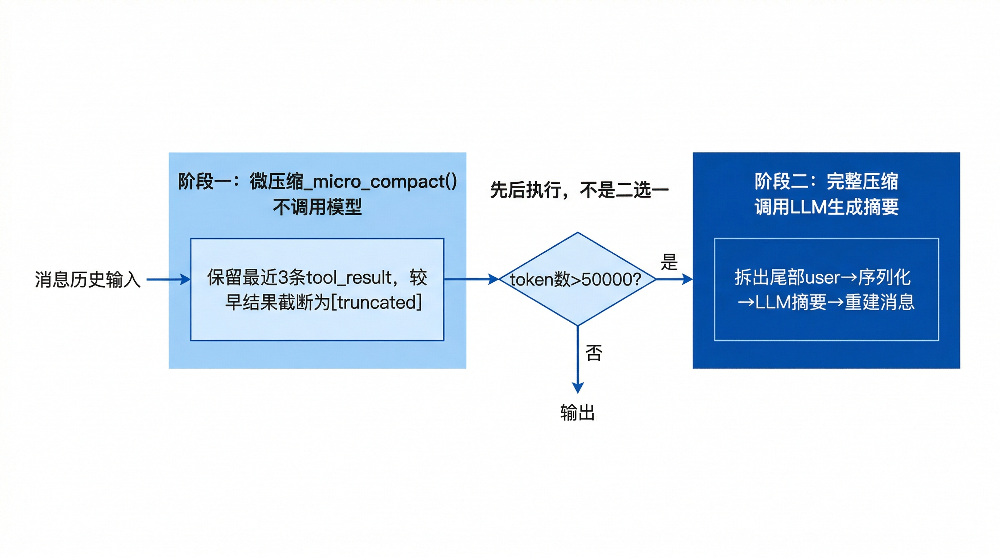

# 消息压缩

BareAgent 的上下文压缩由 `src/memory/compact.py` 和 `src/memory/token_counter.py` 共同完成。它的目标不是做长期知识库，而是让 `agent_loop()` 在对话越来越长、工具结果越来越多时，仍能把上下文控制在一个可继续工作的范围内。

当前实现有两层：

- 微压缩：不调用模型，直接截断较早的工具结果
- 完整压缩：调用 provider 生成摘要，用摘要替换旧上下文

这两层不是二选一关系，而是先后执行的。



## 11.1 微压缩

`Compactor.__call__()` 每次被调用时，都会先执行：

```python
_micro_compact(messages, keep_recent=3)
```

也就是说，即使当前 token 还没有超过完整压缩阈值，较早的工具结果也可能先被缩短。

### 处理对象

微压缩只处理消息历史中的 `tool_result` block，不会改动：

- 普通用户消息
- assistant 文本
- system 消息
- `tool_use` block

它会先遍历整段消息，建立：

```text
tool_use_id -> tool_name
```

的映射。这样在压缩某条工具结果时，仍能保留“这是哪个工具产出的结果”。

### 保留最近 3 组工具结果

当前实现不是按字符数逐段裁剪，而是先找出“哪些消息包含 `tool_result`”，然后默认保留最近 3 条这类消息，其余更早的结果统一截断。

因此它的粒度是：

- 保留最近 3 条 `tool_result` 消息
- 更早的 `tool_result` 消息原地替换成摘要标记

如果某条消息里包含多个 `tool_result` block，这条消息里的所有旧结果都会一起被处理。

### 截断格式

旧工具结果会被改写成下面这种文本：

```text
[truncated: bash result, 1204 chars]
```

这里保留了三件事：

- 被截断的是哪个工具的结果
- 原始结果的字符数
- 这是一个已经压缩过的占位标记

如果某个 `tool_result` 本身已经是以 `[truncated:` 开头的占位文本，微压缩不会再次处理它。

### 原地修改

微压缩直接修改传入的 `messages` 列表，不会创建一份新副本。这是一个非常轻量的“瘦身”步骤，主要目的是避免历史上大量 shell 输出、文件内容或搜索结果持续占用上下文。

## 11.2 完整压缩

完整压缩同样由 `Compactor.__call__()` 负责，但它只会在下面两种情况下触发：

- `force=True`
- `estimate_tokens(messages)` 超过阈值

主 REPL 默认阈值是：

```text
50000
```

### 触发前的拆分

在生成摘要之前，`Compactor` 会先调用 `_split_pending_user_turn(messages)`。当前实现的语义很直接：

- 如果最后一条消息的 `role == "user"`，就先把它拆出来
- 这条尾部用户消息不参与摘要生成
- 压缩完成后再把它追加回消息列表

这里并不区分这条 `user` 消息是：

- 普通用户输入
- 还是上一轮工具回合产生的 `tool_result`

也就是说，完整压缩会优先保留“最后一条仍在对话尾部的 user message”。

### 送给模型的摘要材料

用于摘要的源消息是：

- 已拆出尾部 user message 之后的历史
- 再排除所有 `role == "system"` 的消息

如果过滤后已经没有任何可总结的非 system 历史，完整压缩会直接退出，不做任何修改。

实际发给 provider 的提示由两条消息组成：

1. 一条固定的 system prompt，要求“用中文总结目标、已完成工作、关键约束、重要路径和后续所需上下文”
2. 一条 user prompt，正文是 `_serialize(summary_source_messages)` 的结果

### `_serialize()` 的展开格式

摘要并不是直接把原始 JSON 丢给模型，而是先序列化成一种更适合阅读的文本格式，例如：

```text
[user]
请读取配置

[assistant]
[tool_use:read_file] {"file_path": "config.toml"}

[user]
[tool_result:read_file] 1: [provider]
2: ...
```

其中：

- 普通文本会按原文保留
- `tool_use` 会变成 `[tool_use:<name>] <input>`
- `tool_result` 会变成 `[tool_result:<name>] <content>`

这样摘要模型看到的是“带角色和工具语义的文字版对话”，而不是零散 block。

### transcript 快照

如果 `Compactor` 构造时带了 `TranscriptManager`，在真正请求摘要之前，会先把原始 `messages` 保存一份 transcript 快照。

主 REPL 会这样构造压缩器：

```python
Compactor(
    provider=provider,
    transcript_mgr=transcript_mgr,
    session_id=session_id,
)
```

因此手动 `/compact` 和自动完整压缩都会先落一份会话快照，再尝试压缩。

### 压缩成功后的重建

如果摘要生成成功，原消息列表会被整体重写为：

1. 所有原有的 system 消息
2. 一条 `role="user"` 的压缩摘要消息，前缀固定为 `[Context Compressed]`
3. 一条固定的 assistant 确认消息
4. 如果刚才拆出了尾部 user message，再把它追加回去

重建后的核心形态如下：

```python
[
    {"role": "system", "content": "..."},
    {"role": "user", "content": "[Context Compressed]\n...摘要..."},
    {"role": "assistant", "content": "收到，我已理解之前的上下文，继续工作。"},
    ...
]
```

这意味着完整压缩后，历史不再以“原始多轮对话”存在，而是被折叠成一段摘要性 user message。

### 失败语义

如果摘要调用抛异常，`Compactor` 只会记录 warning，然后原样保留当前消息历史，不会把会话压坏。

换句话说，完整压缩是“尽量做”，不是“必须成功”。

## 11.3 触发策略

压缩器本身只负责实现，不负责决定什么时候接入。当前仓库里有三种主要接入方式。

### 主 REPL 自动触发

主循环在 `agent_loop()` 的每轮开头都会调用 `compact(messages)`。在完整 REPL 环境里，这个 `compact` 实际上是 `main.py` 里的包装函数：

1. 先刷新 TODO nag reminder
2. 再调用真正的 `Compactor`

因此主 REPL 的上下文整理顺序是：

```text
nag reminder 刷新 -> 微压缩 -> 可能的完整压缩
```

### `/compact` 手动触发

REPL 的 `/compact` 命令会显式执行：

```python
compact_fn(messages, force=True)
```

所以即使当前 token 还没有达到阈值，也会直接进入完整压缩路径。

压缩完成后，主 REPL 还会再保存一次 transcript 快照，并打印：

```text
Context compaction finished.
```

### 子智能体与 team agent 的差异

同步子智能体会单独创建一个自己的 `Compactor`，阈值同样是 `50000`，但：

- `transcript_mgr=None`
- 不会保存自己的压缩快照

长期运行的 `AutonomousAgent` 则没有接入 compactor。它在内部调用 `agent_loop()` 时传入的是：

```python
compact_fn=lambda _messages: None
```

因此当前 team 队友不会自动做上下文压缩。

### session id 绑定

`Compactor` 还额外暴露了：

- `get_session_id()`
- `set_session_id()`

主 REPL 会在 `/new` 和 `/resume` 时重绑这个 session id，避免之后保存 transcript 快照时混进旧会话名。

## 11.4 保留策略

完整压缩不是“保留最近 N 条消息”，而是按角色和位置做保留。

### 始终保留的内容

所有 `role == "system"` 的消息都会完整保留。这包括：

- 初始系统提示
- 技能清单摘要
- nag reminder
- 后台通知
- 其他由运行时注入的 system 消息

实现上，这一步会对 system 消息做 JSON 级深拷贝，然后再重建消息历史，避免共享可变对象。

### 尾部 user message 的保留

最后一条 `role == "user"` 的消息会被暂时拆出，不参与摘要，再原样放回末尾。

这样做的直接好处是：

- 避免把“当前待处理的最新输入”压进摘要
- 让下一轮模型调用仍能看见一个明确的对话尾部

### 微压缩与完整压缩的叠加

完整压缩前，旧 `tool_result` 很可能已经先被微压缩过了。因此摘要模型看到的历史，可能本身已经包含若干：

```text
[truncated: ...]
```

当前实现接受这种叠加关系，不会试图恢复原始工具输出。

## 11.5 Token 估算

完整压缩是否触发，依赖 `src/memory/token_counter.py` 中的 `estimate_tokens(messages)`。这不是某家 provider 的精确 tokenizer，而是一个快速启发式估算器。

### 估算权重

当前字符权重大致如下：

| 字符类型 | 权重 |
|------|------|
| CJK（中日韩字符） | `1.5` |
| ASCII 字母数字 | `0.25` |
| 空白字符 | `0.25` |
| 其他字符 | `0.5` |

最终会把累计结果向上取整。

### 递归统计对象

`estimate_tokens()` 不只统计纯字符串。它会递归处理：

- 字符串
- 列表
- 字典
- `tool_use` / `tool_result` / `text` block

例如：

- `tool_use` 会把工具名和 `input` 一起计入
- 普通带 `content` 的 block 会继续递归它的内容
- 非字符串对象会先转成 JSON 字符串再估算

### 它的定位

这个估算器的作用是“快速判断上下文是否大概率变长到需要压缩”，而不是“精确预测下一次 provider 计费 token”。所以在阅读这部分代码时，最合适的心智模型是：

- 它是一个便宜的近似阈值判断器
- 不是厂商 tokenizer 的替代品

## 小结

BareAgent 的上下文压缩策略可以概括为：

1. 每轮先做微压缩，优先瘦掉旧工具结果
2. 超过阈值或手动 `/compact` 时，再做完整压缩
3. 完整压缩保留所有 system 消息和尾部 user message
4. token 判断依赖轻量启发式估算，而不是精确 tokenizer

下一章会介绍另一个同样和“长期工作”有关的基础设施：BareAgent 如何区分持久化任务与会话级 TODO，并把它们暴露成一组可被 agent 使用的工具。
