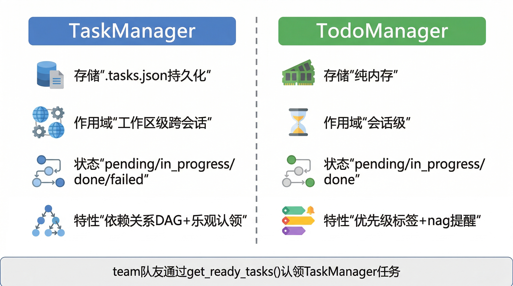

# 任务与 TODO

BareAgent 当前有两套名字相近、但职责完全不同的任务机制：

- `TaskManager`：工作区级、持久化、可带依赖关系
- `TodoManager`：会话级、纯内存、用于跟踪当前对话中的短期待办

它们都位于 `src/planning/`，也都向模型暴露了工具，但心智模型不能混在一起。



## 12.1 `TaskManager`

`TaskManager` 实现位于 `src/planning/tasks.py`。它管理的是一个工作区共享的任务图，而不是某一次对话里的临时清单。

### 持久化文件

默认任务文件是工作区根目录下的：

```text
.tasks.json
```

文件结构当前非常直接：

```json
{
  "tasks": {
    "abc12345": {
      "id": "abc12345",
      "title": "Review module",
      "description": "Inspect the updated manager implementation",
      "status": "pending",
      "depends_on": [],
      "created_at": "2026-04-03T00:00:00+00:00",
      "updated_at": "2026-04-03T00:00:00+00:00"
    }
  }
}
```

保存时使用的是 `atomic_write_json()`：

- 先写临时文件
- 再用 `os.replace()` 原子替换

所以它的持久化方式是“整文件原子覆盖”，不是日志追加。

### `Task` 数据类

每个任务由 `Task` 数据类表示，当前字段如下：

| 字段 | 含义 |
|------|------|
| `id` | 8 位随机字母数字 id |
| `title` | 任务标题，不能为空 |
| `description` | 可选描述 |
| `status` | `pending` / `in_progress` / `done` / `failed` |
| `depends_on` | 依赖任务 id 列表 |
| `created_at` | UTC ISO 时间戳 |
| `updated_at` | UTC ISO 时间戳 |

### 当前依赖模型

大纲里可以把这类系统讲成 `blocks / blockedBy` 图，但当前 BareAgent 的真实实现更简单：

- 只持久化一个 `depends_on` 单向字段
- 不单独维护 `blocks`
- 也不单独维护 `blocked_by`

因此“谁阻塞了谁”是运行时从 `depends_on` 关系推导出来的，不是单独存储的冗余字段。

### `create()`

`create(title, description="", depends_on=None)` 会做以下事情：

1. 去掉标题首尾空白
2. 拒绝空标题
3. 规范化 `depends_on`
4. 校验所有依赖任务 id 都存在
5. 生成新 id 和 UTC 时间戳
6. 先把任务放进内存图
7. 校验整个依赖图无环
8. 保存到 `.tasks.json`

这里的 `depends_on` 规范化有两个细节：

- 空白 id 会报错
- 重复依赖会自动去重

### 循环依赖检测

`TaskManager` 每次创建任务和每次加载任务文件时，都会执行 DFS 检查，确保依赖图无环。

如果出现环，例如：

```text
A depends_on B
B depends_on A
```

会直接抛出：

```text
ValueError("Cyclic task dependency detected at: ...")
```

### `update()`

`update()` 当前支持更新：

- `status`
- `title`

其中 `status` 只允许以下四个值：

- `pending`
- `in_progress`
- `done`
- `failed`

如果确实发生了变更，`updated_at` 会刷新并重新保存任务文件。

### `expected_status` 的乐观认领语义

虽然对外工具 `task_update` 没有暴露 `expected_status`，但 `TaskManager.update()` 本身支持这个参数。它主要给 team 自治 agent 使用，用于“先检查状态，再原子认领任务”。

典型调用是：

```python
task_manager.update(task.id, status="in_progress", expected_status="pending")
```

如果任务在认领前已经被别人改成了别的状态，就会抛 `ValueError`，从而避免重复认领。

### 查询接口

当前查询相关方法有三个：

| 方法 | 作用 |
|------|------|
| `get(task_id)` | 读取单个任务 |
| `list(status=None)` | 列出全部或按状态过滤 |
| `get_ready_tasks()` | 找出当前可执行的 `pending` 任务 |

其中 `get_ready_tasks()` 的判定条件是：

- 任务当前状态必须是 `pending`
- 且 `depends_on` 中的所有任务都已经是 `done`

这使 `TaskManager` 可以被长期运行的 teammate 当成一个简单的任务队列使用。

### 加载失败时的 REPL 行为

主 REPL 启动时会尝试加载工作区的 `.tasks.json`。如果这个文件损坏或结构非法：

- 会打印错误
- 但不会让整个 REPL 退出

也就是说，任务系统故障不会把整台 agent 直接拖死。

## 12.2 `TodoManager`

`TodoManager` 实现位于 `src/planning/todo.py`。它处理的是“这次会话里我接下来要做什么”，而不是长期持久化任务。

### 存储模型

它只有内存态，没有落盘文件。内部结构大致是：

```python
{
    "t1": {"task": "...", "status": "pending", "priority": "normal"},
    "t2": {"task": "...", "status": "in_progress", "priority": "high"},
}
```

ID 按顺序自增：

```text
t1, t2, t3, ...
```

### 生命周期

`TodoManager` 跟随当前 REPL 会话存在。`/new` 和 `/clear` 会显式调用：

```python
todo_manager.reset()
```

因此 TODO 会在新会话开始时清空，但不会影响 `.tasks.json` 中的持久化任务。

### 支持的状态

TODO 当前只允许三种状态：

- `pending`
- `in_progress`
- `done`

与 `TaskManager` 相比，它没有 `failed` 状态，因为它的定位不是做正式任务编排，而是给当前 agent 保持“短期执行清单”。

### `priority` 的真实语义

大纲里很容易把 TODO priority 讲成固定枚举，比如 `high / medium / low`，但当前实现其实没有做枚举校验。

真实行为是：

- 默认值是 `normal`
- 传入什么字符串就存什么字符串
- 只会做 `strip()` 和空串回退

所以它更接近“标签”，而不是受限的优先级类型系统。

### `list()`

`list()` 返回的是面向 LLM 的可读文本，而不是 JSON。例如：

```text
TODO items:
- t1 [done] (normal) Create planner
- t2 [pending] (high) Write tests
```

如果当前没有任何 TODO，会返回：

```text
No TODO items.
```

### nag reminder

`TodoManager.get_nag_reminder()` 会汇总所有未完成项，并生成一段提醒文本，例如：

```text
You still have unfinished TODO items. Keep them in sync with your progress.
- t1 [pending] (normal) ...
- t2 [in_progress] (high) ...
```

如果所有 TODO 都已完成，则返回 `None`。

这不是一个独立后台线程，而是主 REPL 在每次进入 `compact_fn` 前，主动把这段提醒注入消息历史。

### 提醒消息的插入位置

主 REPL 会把 nag reminder 包装成：

```text
<nag-reminder>
...
</nag-reminder>
```

的 system 消息，并尽量插在“最近一条真实用户消息之后”。

当前实现特意避免把 nag reminder 插到：

- assistant 的 `tool_use`
- 和紧随其后的 `tool_result`

之间。这样可以保持工具调用回合结构完整，不打断 assistant -> tool_result 的配对关系。

## 12.3 对应工具

任务和 TODO 都通过工具暴露给模型，但返回值形态并不完全一致。

### `task_*`

`TaskManager` 对应 4 个工具：

| 工具 | 作用 | 返回 |
|------|------|------|
| `task_create` | 创建持久化任务 | 单个任务字典 |
| `task_update` | 更新状态和/或标题 | 单个任务字典 |
| `task_get` | 读取单个任务 | 单个任务字典 |
| `task_list` | 列出任务，可按状态过滤 | `list[task-dict]` |

当前 schema 和 handler 还暴露出几个实际边界：

- `task_create` 允许 `description=""`
- `task_create` 允许 `depends_on=[]`
- `task_update` 的 schema 里 `status` 和 `title` 都是可选
- 但 handler 实际要求两者至少提供一个，否则报错

### `todo_*`

`TodoManager` 对应 2 个工具：

| 工具 | 作用 | 返回 |
|------|------|------|
| `todo_write` | 新建或更新 TODO | 状态字符串 |
| `todo_read` | 列出当前 TODO | 文本列表 |

`todo_write` 通过 `action` 分流：

- `action="add"` 时需要 `task`，可选 `priority`
- `action="update"` 时需要 `task_id` 和 `status`

### 权限侧的细节

这几组工具在权限模型里也有不同待遇：

- `todo_read` / `todo_write` 被视为 safe tools
- `task_list` / `task_get` 也是 safe tools
- `task_create` / `task_update` 在 `DEFAULT` 和 `AUTO` 下不会额外确认
- 但在 `PLAN` 模式下，`task_create` / `task_update` 仍会被拦截

因此“工具存在”不等于“所有模式下都能执行”。

### 与 team 系统的衔接

`TaskManager` 不只给主 agent 用。长期运行的 `AutonomousAgent` 还会这样使用它：

1. 周期性调用 `get_ready_tasks()`
2. 用 `expected_status="pending"` 尝试乐观认领
3. 执行任务
4. 成功则标记 `done`
5. 失败则标记 `failed`

所以任务系统和多智能体系统之间并不是隔离的，而是通过“ready task + 状态流转”自然衔接。

## 小结

BareAgent 当前的两套待办机制可以这样区分：

1. `TaskManager` 是工作区级的正式任务图，落盘到 `.tasks.json`
2. `TodoManager` 是会话级的临时执行清单，只存在内存里
3. `task_*` 更适合跨回合、跨 agent 的工作编排
4. `todo_*` 更适合让当前 agent 在一次会话里保持节奏和提醒

下一章会介绍另一类“按需加载”的规划层能力：BareAgent 如何扫描 `skills/` 目录，并在需要时把某个 `SKILL.md` 注入到当前上下文中。
