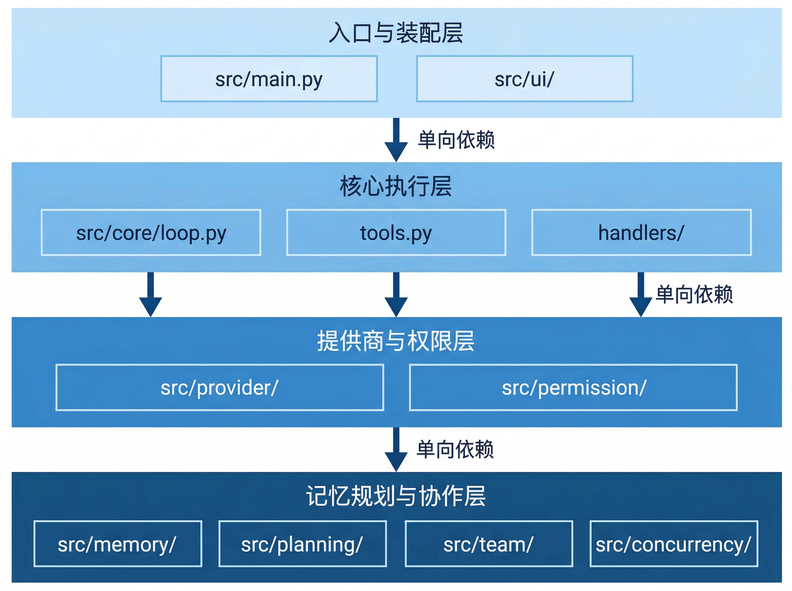

# 开发指南

本章面向继续维护 BareAgent 的开发者，重点不是重复 README，而是给出一份“读代码和扩展功能时，真正会用到的入口地图”。

当前仓库的核心是一个纯 Python 终端 agent，代码主要集中在 `src/`，文档在 `docs/`，技能和测试也都直接跟仓库一起维护。

## 15.1 项目结构

当前主要目录可以按职责分成下面几层。



### 入口与装配

| 位置 | 作用 |
|------|------|
| `src/main.py` | 程序入口、配置加载、REPL、命令处理、运行时装配 |
| `src/core/context.py` | 组装系统提示 |
| `src/ui/` | 终端输出、流式打印 |

如果你想理解“BareAgent 启动之后先创建了哪些对象、它们怎么串起来”，优先读 `src/main.py`。

### 核心执行层

| 位置 | 作用 |
|------|------|
| `src/core/loop.py` | `agent_loop()` 主回路 |
| `src/core/tools.py` | 工具 schema 注册和 handler 装配 |
| `src/core/schema.py` | 统一 tool schema 构造 |
| `src/core/handlers/` | bash、文件、搜索类工具的具体实现 |
| `src/core/fileutil.py` | 原子写 JSON、随机 id 等公共工具 |

这一层决定了“模型怎么调工具、工具怎么运行、结果怎么回到消息历史”。

### 配置、提供商与权限

| 位置 | 作用 |
|------|------|
| `src/provider/base.py` | `BaseLLMProvider`、`LLMResponse`、`ThinkingConfig` |
| `src/provider/anthropic.py` | Anthropic 适配 |
| `src/provider/openai.py` | OpenAI 适配 |
| `src/provider/factory.py` | provider 工厂 |
| `src/permission/guard.py` | 4 种权限模式和确认逻辑 |
| `src/permission/rules.py` | allow/deny 规则解析 |

如果你想接入新的模型提供商或调整权限策略，这一层是第一入口。

### 记忆、规划与协作

| 位置 | 作用 |
|------|------|
| `src/memory/` | 压缩、token 估算、会话转录 |
| `src/planning/` | 子智能体、任务、TODO、技能 |
| `src/team/` | 多智能体邮箱、协议、自治 agent |
| `src/concurrency/` | 后台线程和通知注入 |

这部分决定了 BareAgent 是否能长时间工作、如何拆任务、如何和队友通信。

### 资源与辅助目录

| 位置 | 作用 |
|------|------|
| `skills/` | 内置技能目录，按 `skills/*/SKILL.md` 组织 |
| `tests/` | pytest 测试 |
| `docs/` | VitePress 文档源文件 |
| `config.toml` | 默认配置 |

## 15.2 开发环境搭建

当前 `pyproject.toml` 里声明的基础要求是：

- Python `>=3.12`
- 使用 `hatchling` 构建

仓库推荐的日常开发方式是 `uv`。

### 安装依赖

在仓库根目录执行：

```bash
uv pip install -e ".[dev]"
```

这会安装：

- 运行时依赖：`anthropic`、`openai`、`rich`、`prompt-toolkit`
- 开发依赖：`pytest`、`ruff`

如果你要真正启动 REPL，还需要自己准备对应 provider 的 API key 环境变量。

### 包入口

`pyproject.toml` 已注册控制台脚本：

```text
bareagent = "src.main:main"
```

因此常见启动方式有两种：

```bash
bareagent
```

或：

```bash
python -m src.main
```

### 技能与配置会随分发一起打包

当前打包配置已经显式包含：

- `skills/`
- `config.toml`

所以在修改默认技能或默认配置时，要把它们视为发布产物的一部分，而不只是本地辅助文件。

## 15.3 测试

当前仓库下共有：

```text
29 个 tests/test_*.py 文件
```

这些测试覆盖的主题比较分散，但大体可分为：

- 配置与 provider
- 工具与权限
- agent loop 与 REPL
- 压缩、任务、TODO、技能
- team / mailbox / background

### 常用命令

```bash
pytest
```

运行单个文件：

```bash
pytest tests/test_loop.py
```

按测试名关键字筛选：

```bash
pytest tests/test_loop.py -k "test_name"
```

### 关于 `*_manual.py`

仓库里有一些名字带 `_manual` 的 pytest 文件，例如：

- `tests/test_compact_manual.py`
- `tests/test_tasks_manual.py`
- `tests/test_provider_manual.py`

它们仍然是普通 pytest 测试文件，不需要专门的测试运行器；只是场景通常更偏“手工验证式”或“集成行为式”。

### 新增功能时的测试建议

从当前测试风格看，比较符合仓库习惯的做法是：

- 用 `tmp_path` 隔离文件系统状态
- provider 相关逻辑尽量用 fake / stub
- 行为验证优先于内部实现细节
- 关注消息顺序、提示文本和状态流转

## 15.4 代码检查与格式化

当前仓库使用 `ruff` 做静态检查和格式化。

### 检查

```bash
ruff check src tests
```

### 自动修复

```bash
ruff check --fix src tests
```

### 格式化

```bash
ruff format src tests
```

因为 `ruff format` 会直接改文件，所以在处理较大改动前后都值得看一眼 `git diff`，确认没有引入无关 churn。

## 15.5 提交规范

仓库当前文档和内置 `git` skill 都以 Conventional Commits 为准。最稳妥的格式是：

```text
<type>(<scope>): <summary>
```

其中：

- `type` 建议使用小写
- `scope` 可选
- `summary` 用祈使句，尽量简短

常见类型包括：

- `feat`
- `fix`
- `refactor`
- `test`
- `docs`
- `chore`

例如：

```text
docs(memory): complete compaction chapter
fix(main): rebind compact session id after resume
test(tasks): cover cyclic dependency validation
```

### 提交前习惯

结合当前仓库风格，提交前至少值得检查：

- `git diff --stat` 是否只包含本次改动
- 相关测试是否已运行
- 新的用户可见文本是否一致
- 是否不小心带入调试输出

## 15.6 扩展点

BareAgent 现在的扩展面不算多，但都比较明确。

### 新增 LLM 提供商

至少需要修改这些位置：

- 在 `src/provider/` 下新增 provider 实现
- 让它继承 `BaseLLMProvider`
- 在 `src/provider/factory.py` 的 `create_provider()` 里注册分支

如果你希望它像内置 provider 一样有默认 API key 环境变量，还需要同步更新 `src/main.py` 里的：

```python
DEFAULT_API_KEY_ENV_BY_PROVIDER
```

否则 CLI 层不会知道该默认读取哪个环境变量名。

### 新增工具

最典型的接入步骤是：

1. 在 `src/core/schema.py` 或相关模块定义 schema
2. 在 `src/core/tools.py` 把 schema 加进 `TOOL_SCHEMAS`
3. 实现对应 handler
4. 在 `get_handlers()` 中把运行时依赖绑定进去
5. 根据风险级别更新 `PermissionGuard`
6. 补测试

如果工具属于规划层能力，也可能直接把 schema 和 handler 放在 `src/planning/` 下，再由 `src/core/tools.py` 装配。

### 新增智能体类型

子智能体类型注册点在：

```python
src/planning/agent_types.py
```

当前内置类型都集中在 `BUILTIN_AGENT_TYPES`。新增类型时通常需要同时考虑：

- `description`
- `system_prompt`
- `disallowed_tools` 或 `tools`
- `max_turns`
- `allow_nesting`
- `permission_mode`

也就是说，新增类型不只是“起个名字”，而是定义一个完整的行为边界。

### 新增技能

技能扩展是最轻的一类。当前只需要：

```text
skills/<name>/SKILL.md
```

然后保证：

- 描述写在标题后的第一条非空非标题行
- 内容足够让模型直接使用

下次扫描时它就会自动出现在技能清单里。

### 文档扩展

文档系统当前使用 VitePress，关键入口是：

- `docs/.vitepress/config.mts`
- `docs/guide/`

如果你新增章节，除了正文文件本身，还要同步更新 `config.mts` 中的 `sidebar` 配置，否则新页面不会出现在侧边栏中。

本地预览：

```bash
cd docs
npm run docs:dev
```

## 小结

维护 BareAgent 时，最重要的不是记住所有文件，而是知道“哪类改动去找哪层入口”：

1. 启动和装配问题先看 `src/main.py`
2. 工具和执行回路问题看 `src/core/`
3. provider 与权限看 `src/provider/` 和 `src/permission/`
4. 压缩、任务、技能、team、后台分别在 `src/memory/`、`src/planning/`、`src/team/`、`src/concurrency/`
5. 测试、技能和文档都直接随仓库维护，不是外置资源

至此，BareAgent 从概览、配置、REPL、工具、权限、provider、执行回路、子智能体、多智能体，到压缩、任务、技能、后台和开发方式的整套结构就基本串起来了。
