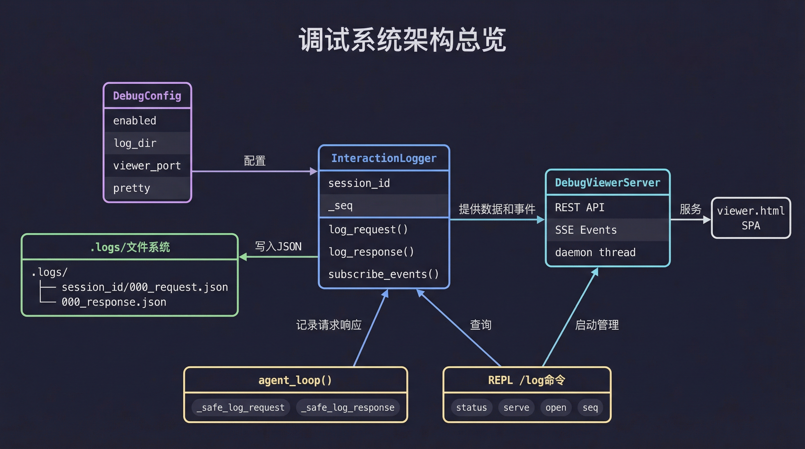
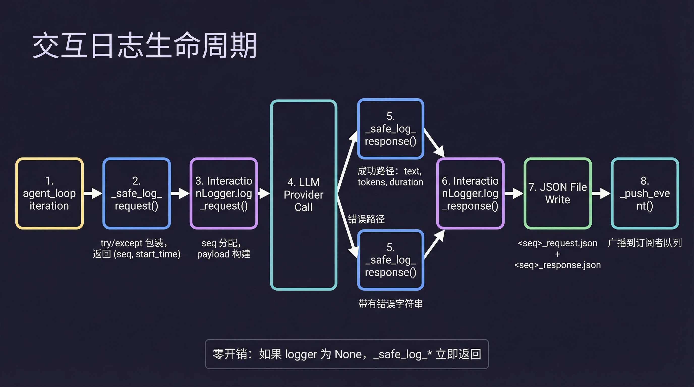
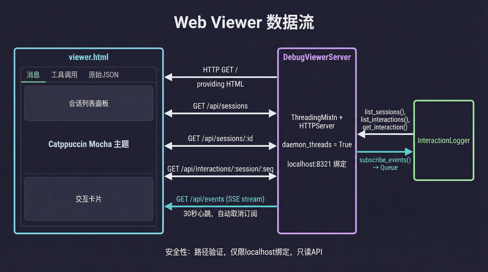

# 调试与日志系统

BareAgent 内置了一套完整的调试日志系统，能够记录每一轮 LLM 交互的完整请求和响应，并通过 Web Viewer 实时可视化。这套系统的设计目标是"零成本 opt-in"：未启用时不产生任何开销，启用后也不会影响主循环的稳定性。

## 16.1 架构总览

调试系统由四个组件和两个集成点构成。

### 四个组件

| 组件 | 位置 | 职责 |
|------|------|------|
| `DebugConfig` | `src/main.py` | 配置数据类，承载 `enabled`、`log_dir`、`viewer_port`、`pretty` |
| `InteractionLogger` | `src/debug/interaction_log.py` | 核心日志引擎，负责写入 JSON 文件和推送事件 |
| `DebugViewerServer` | `src/debug/web_viewer.py` | HTTP 服务端，提供 REST API 和 SSE 实时推送 |
| `viewer.html` | `src/debug/viewer.html` | 单页前端应用，Catppuccin Mocha 主题 |

### 两个集成点

| 集成点 | 位置 | 作用 |
|--------|------|------|
| `agent_loop()` 安全包装 | `src/core/loop.py` | 每轮迭代自动记录请求和响应 |
| REPL `/log` 命令 | `src/main.py` | 用户查看日志状态、启动 Viewer、查询交互详情 |



数据流向是单向的：`agent_loop()` 在每轮迭代中通过安全包装函数将数据写入 `InteractionLogger`，`InteractionLogger` 将 JSON 文件持久化到 `.logs/` 目录，同时将事件推送到订阅队列。`DebugViewerServer` 从 `InteractionLogger` 读取数据，通过 REST API 和 SSE 提供给浏览器端的 `viewer.html`。

## 16.2 配置

### `[debug]` 配置段

| 字段 | 类型 | 默认值 | 说明 |
|------|------|--------|------|
| `enabled` | `bool` | `false` | 是否启用调试日志 |
| `log_dir` | `string` | `".logs"` | 日志存储目录，相对路径基于工作目录解析 |
| `viewer_port` | `int` | `8321` | Web Viewer 监听端口 |
| `pretty` | `bool` | `true` | JSON 文件是否使用缩进格式化 |

示例：

```toml
[debug]
enabled = true
log_dir = ".logs"
viewer_port = 8321
pretty = true
```

### 环境变量覆盖

| 环境变量 | 覆盖字段 | 类型 |
|----------|----------|------|
| `BAREAGENT_DEBUG` | `enabled` | 布尔值（`1`/`true`/`yes`/`on`） |
| `BAREAGENT_DEBUG_LOG_DIR` | `log_dir` | 字符串 |
| `BAREAGENT_DEBUG_VIEWER_PORT` | `viewer_port` | 整数 |
| `BAREAGENT_DEBUG_PRETTY` | `pretty` | 布尔值 |

环境变量的优先级高于 TOML 配置文件，与其他 `BAREAGENT_*` 变量的行为一致。

`DebugConfig` 是一个 `@dataclass(slots=True)` 数据类，在 `load_config()` 中与其他配置段一起解析。当 `enabled` 为 `False` 时，`_build_interaction_logger()` 直接返回 `None`，后续所有日志路径都会被跳过。

## 16.3 InteractionLogger

`InteractionLogger` 是调试系统的核心引擎，负责将 LLM 交互持久化为 JSON 文件，并向订阅者推送实时事件。

### 初始化与会话管理

构造函数接受三个参数：

```python
InteractionLogger(
    log_dir=".logs",
    session_id="default",
    pretty=True,
)
```

`session_id` 是一个可变属性，支持在运行时更新。设置新值时会触发校验并重置内部状态：

```python
logger.session_id = new_session_id  # 重置 _session_dir 和 _seq
```

校验规则：
- 不能为空字符串、`.` 或 `..`
- 不能包含路径分隔符（`/` 或 `\`）
- 不能是绝对路径
- 必须是单个路径段（同时检查 POSIX 和 Windows 路径语义）

这些校验确保 session_id 不会被用于路径遍历攻击。

### 请求日志

`log_request()` 记录一次 LLM 请求的完整上下文：

```python
seq = logger.log_request(
    messages,       # 完整消息历史
    tools,          # 当前工具 schema 列表
    provider_info={"name": "openai", "model": "gpt-4.1"},
)
```

返回值 `seq` 是本次交互的序号，从 0 开始递增。

请求 payload 字段：

| 字段 | 类型 | 说明 |
|------|------|------|
| `seq` | `int` | 交互序号 |
| `type` | `string` | 固定为 `"request"` |
| `timestamp` | `float` | Unix 时间戳 |
| `provider` | `dict` | provider 信息（名称、模型等） |
| `messages` | `list` | 完整消息历史 |
| `tools` | `list` | 工具 schema 列表 |
| `message_count` | `int` | 消息数量 |
| `tool_count` | `int` | 工具数量 |

### 响应日志

`log_response()` 记录 LLM 响应或错误：

```python
logger.log_response(
    seq,
    text="Hello!",
    thinking="...",
    tool_calls=[{"name": "bash", "input": {...}}],
    input_tokens=1500,
    output_tokens=200,
    duration_ms=1234.56,
    error=None,  # 或错误信息字符串
)
```

响应 payload 字段：

| 字段 | 类型 | 说明 |
|------|------|------|
| `seq` | `int` | 交互序号（与请求对应） |
| `type` | `string` | 固定为 `"response"` |
| `timestamp` | `float` | Unix 时间戳 |
| `text` | `string` | LLM 文本输出 |
| `thinking` | `string` | 思考过程文本 |
| `tool_calls` | `list` | 工具调用列表 |
| `input_tokens` | `int` | 输入 token 数 |
| `output_tokens` | `int` | 输出 token 数 |
| `duration_ms` | `float` | 调用耗时（毫秒） |
| `error` | `string?` | 错误信息，仅在失败时出现 |

### 文件结构

每个会话的日志存储在独立子目录中，文件按序号和类型命名：

```text
.logs/
├── 20260408-120000-123456-abc123/
│   ├── 000_request.json
│   ├── 000_response.json
│   ├── 001_request.json
│   ├── 001_response.json
│   └── ...
├── 20260408-140000-789012-def456/
│   └── ...
```

文件名格式为 `<seq:03d>_<type>.json`，其中 `seq` 用三位数字零填充。恢复会话时，`InteractionLogger` 会扫描已有文件，自动从最大序号的下一个开始继续编号。



### 事件订阅

`InteractionLogger` 支持多订阅者的实时事件推送：

```python
event_queue = logger.subscribe_events(maxsize=256)
# ... 消费事件 ...
logger.unsubscribe_events(event_queue)
```

每次 `log_request()` 或 `log_response()` 完成后，都会通过 `_push_event()` 向所有订阅者广播事件。

事件格式：

```json
{
  "event": "request",
  "session_id": "20260408-120000-123456-abc123",
  "seq": 0,
  "timestamp": 1712563200.0
}
```

背压处理：当订阅队列已满时（默认 256 条），`_publish_event()` 会丢弃队列中最旧的一条事件，然后尝试放入新事件。如果仍然失败，则静默丢弃。这保证了日志写入永远不会因为消费者过慢而阻塞。

### 查询接口

`InteractionLogger` 提供三个只读查询方法：

| 方法 | 返回值 | 说明 |
|------|--------|------|
| `list_sessions()` | `list[str]` | 列出所有会话 ID |
| `list_interactions(session_id)` | `list[dict]` | 列出指定会话的所有交互摘要 |
| `get_interaction(session_id, seq)` | `dict` | 获取指定交互的完整请求和响应 |

`list_interactions()` 返回的摘要包含 token 计数、耗时、工具调用数等统计信息，但不包含完整的消息历史和工具 schema，适合用于列表展示。

## 16.4 与 agent_loop() 的集成

调试日志通过两个安全包装函数接入 `agent_loop()` 的主循环，位于 `src/core/loop.py`。

### `_safe_log_request()`

在每轮迭代的 LLM 调用之前执行：

```python
log_seq, log_started_at = _safe_log_request(
    interaction_logger=interaction_logger,
    messages=messages,
    tools=tools,
    provider=provider,
    console=console,
)
```

行为：
- 如果 `interaction_logger` 为 `None`，立即返回 `(None, 0.0)`
- 调用 `log_request()` 记录请求，捕获所有异常
- 异常时通过 `console.print_status()` 输出警告，不中断主循环
- 返回 `(seq, start_time)` 用于后续响应日志

### `_safe_log_response()`

在 LLM 调用成功或失败后执行：

```python
_safe_log_response(
    interaction_logger=interaction_logger,
    log_seq=log_seq,
    console=console,
    text=response.text,
    thinking=response.thinking,
    tool_calls=_serialize_tool_calls(response.tool_calls),
    input_tokens=response.input_tokens,
    output_tokens=response.output_tokens,
    duration_ms=(time.monotonic() - log_started_at) * 1000,
)
```

两条路径：
- 成功路径：记录文本、思考过程、工具调用、token 计数和耗时
- 错误路径：记录 `error` 字符串，耗时仍然被计算

零成本设计：当 `interaction_logger` 为 `None` 或 `log_seq` 为 `None` 时，函数立即返回，不执行任何操作。异常被完全捕获，确保调试日志的任何故障都不会影响 agent 的正常运行。

## 16.5 Web Viewer

Web Viewer 提供了一个浏览器端的调试界面，用于实时查看和回溯 LLM 交互记录。

### 服务端

`DebugViewerServer` 继承自 `ThreadingMixIn` 和 `HTTPServer`，以 daemon 线程运行：

```python
server, thread = start_viewer(logger, port=8321, host="127.0.0.1")
```

关键特性：
- `daemon_threads = True`：所有请求处理线程随主进程退出
- `allow_reuse_address = True`：避免端口占用问题
- 默认绑定 `127.0.0.1`，仅本机可访问

### REST API

| 端点 | 方法 | 返回值 |
|------|------|--------|
| `/` | GET | `viewer.html` 单页应用 |
| `/api/sessions` | GET | 会话 ID 列表 |
| `/api/sessions/:id` | GET | 指定会话的交互摘要列表 |
| `/api/interactions/:session/:seq` | GET | 指定交互的完整请求和响应 |
| `/api/events` | GET | SSE 事件流 |

所有 API 返回 JSON 格式（`Content-Type: application/json`），错误响应包含 `{"error": "message"}` 结构。

### SSE 实时推送

`/api/events` 端点提供 Server-Sent Events 流：

- 每次有新的请求或响应日志时，推送一条 `data: {...}` 事件
- 30 秒无事件时发送 `: heartbeat` 注释行保持连接
- 客户端断开时自动调用 `unsubscribe_events()` 清理订阅
- 每个 SSE 连接独立订阅，互不影响

### 安全边界

- 路径校验：session_id 中的 `/` 会被拒绝，防止路径遍历
- localhost 绑定：默认只监听 `127.0.0.1`，不暴露到网络
- 只读 API：所有端点都是 GET 请求，不支持写操作
- 静默日志：`log_message()` 被覆盖为空操作，不输出 HTTP 请求日志

### 前端 SPA

`viewer.html` 是一个自包含的单页应用，不依赖外部资源：

- 使用 Catppuccin Mocha 配色方案（与 BareAgent 终端主题一致）
- 左侧面板：会话列表，按时间排序
- 主区域：交互卡片列表，显示序号、token 计数、耗时
- 每张卡片包含三个标签页：Messages（消息历史）、Tool Calls（工具调用）、Raw JSON（原始数据）
- 通过 SSE 自动接收新交互，无需手动刷新



## 16.6 `/log` 命令

`/log` 是 REPL 中的调试日志管理入口。

### 子命令

| 子命令 | 作用 | 说明 |
|--------|------|------|
| `/log` 或 `/log status` | 显示日志状态 | 包含日志目录、当前会话、交互数、token 总量、Viewer 状态 |
| `/log serve` | 启动 Web Viewer | 如果已运行则提示当前地址 |
| `/log open` | 启动并打开 Viewer | 自动调用 `webbrowser.open()` 在浏览器中打开 |
| `/log <seq>` | 查看指定交互 | 显示 token 计数、耗时、工具调用数、错误和思考过程摘要 |

### 状态输出示例

```text
Debug logging: enabled
Log dir: .logs
Current session: 20260408-120000-123456-abc123
Interactions: 12
Total tokens: 45000
Sessions: 3
Viewer: http://127.0.0.1:8321
```

### 禁用时的行为

当 `[debug] enabled = false` 时，执行 `/log` 会输出提示：

```text
Debug logging is disabled. Set [debug] enabled = true in config.toml or BAREAGENT_DEBUG=1
```

不会抛出异常，也不会尝试创建任何文件或启动服务。

## 16.7 会话切换

调试日志的 session_id 与 REPL 的会话管理保持同步。

当用户执行 `/new`、`/clear` 或 `/resume` 时，REPL 会调用 `_set_interaction_logger_session()` 更新 `InteractionLogger` 的 `session_id`：

```python
def _set_interaction_logger_session(
    interaction_logger: InteractionLogger | None,
    session_id: str,
) -> None:
    if interaction_logger is None:
        return
    interaction_logger.session_id = session_id
```

设置新的 `session_id` 会：
- 触发路径安全校验
- 重置 `_session_dir` 为 `None`（下次写入时重新创建）
- 重置 `_seq` 为 `0`（如果目录已存在，会从已有文件的最大序号继续）

这意味着恢复一个旧会话后，新的调试日志会继续追加到该会话的日志目录中，而不是创建新目录。

## 小结

调试日志系统的核心设计原则是"安全、透明、零侵入"。`_safe_log_*` 包装确保任何日志故障都不会影响 agent 主循环；`InteractionLogger` 的事件订阅机制让 Web Viewer 能够实时展示交互过程；而 `DebugConfig` 的 `enabled` 开关则保证未启用时完全没有运行时开销。
