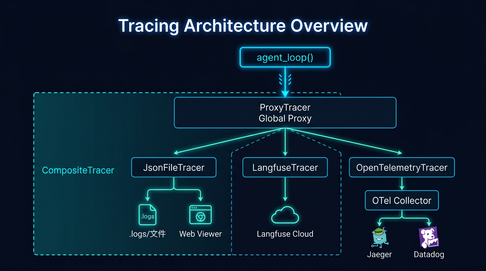
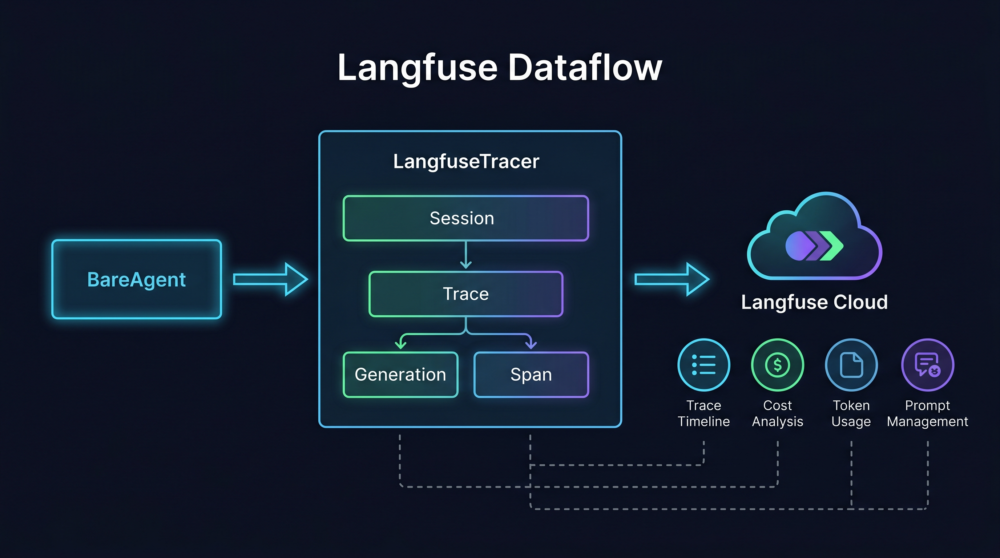
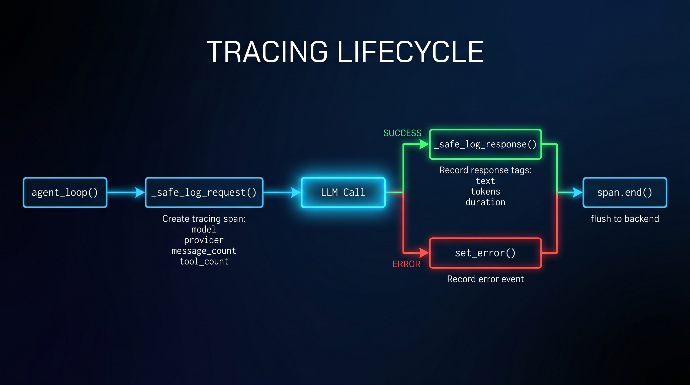

# Tracing 可观测性系统

BareAgent 内置了一套标准化的 tracing 系统，支持 Langfuse、OpenTelemetry 等可插拔后端。这套系统采用 Haystack 风格的热替换代理模式：未配置后端时零开销，运行时可动态切换，多后端可同时扇出。

## 17.1 架构总览

tracing 系统由抽象层、代理层和后端层三层构成。

### 三层架构

| 层级 | 位置 | 职责 |
|------|------|------|
| 抽象层 | `src/tracing/_api.py` | 定义 `Span` 和 `Tracer` 抽象基类，以及零开销的 `NullSpan` / `NullTracer` |
| 代理层 | `src/tracing/_proxy.py` | 全局单例 `ProxyTracer`，支持运行时热替换内部 tracer |
| 后端层 | `src/tracing/langfuse.py` / `otel.py` / `json_file.py` | 具体后端实现，按需激活 |

### 组合与扇出

| 组件 | 位置 | 职责 |
|------|------|------|
| `CompositeTracer` | `src/tracing/composite.py` | 多后端扇出，异常隔离，单个后端故障不影响其他 |
| `configure_tracing()` | `src/tracing/setup.py` | 根据配置和环境变量自动发现并组装后端 |



数据流向：`agent_loop()` 在每轮 LLM 调用前后通过全局 `tracer` 创建 span，`ProxyTracer` 将调用委派给实际后端。当多个后端同时激活时，`CompositeTracer` 将每个 span 操作扇出到所有后端，任何单个后端的异常都会被静默捕获，不影响其他后端和主循环。

## 17.2 核心抽象

### Span

`Span` 表示一次被追踪的操作，提供四个方法：

```python
class Span(abc.ABC):
    def set_tag(self, key: str, value: Any) -> None: ...
    def set_content_tag(self, key: str, value: Any) -> None: ...
    def set_error(self, error: str) -> None: ...
    def end(self) -> None: ...
```

`set_tag()` 用于附加元数据（模型名、工具名等），`set_content_tag()` 用于附加内容敏感数据（消息、输出），后者可通过环境变量全局禁用。

### Tracer

`Tracer` 是创建 span 的工厂接口：

```python
class Tracer(abc.ABC):
    @contextmanager
    def trace(self, operation_name, tags, *, parent_span) -> Iterator[Span]: ...
    def current_span(self) -> Span | None: ...
    def flush(self) -> None: ...
    def shutdown(self) -> None: ...
```

`trace()` 是上下文管理器，自动管理 span 的生命周期。`flush()` 和 `shutdown()` 默认为空操作，后端按需覆盖。

### 零开销设计

`NullSpan` 和 `NullTracer` 是纯空操作实现。未配置任何后端时，全局 `tracer` 内部持有 `NullTracer`，所有 tracing 调用的开销仅为一次方法分派。

## 17.3 全局代理：ProxyTracer

`ProxyTracer` 是整个 tracing 系统的入口点，作为全局单例暴露：

```python
from src.tracing import tracer

with tracer.trace("llm_call", {"model": "claude-sonnet-4-20250514"}) as span:
    span.set_content_tag("input", messages)
    response = provider.create(messages, tools)
    span.set_content_tag("output", response.text)
    span.set_tag("input_tokens", response.input_tokens)
```

任何模块只需 `from src.tracing import tracer` 即可使用，无需关心底层后端是什么。

### 热替换机制

`ProxyTracer` 内部持有一个 `_inner` tracer，通过 `enable_tracing()` 在运行时替换：

```python
from src.tracing import enable_tracing
from src.tracing.langfuse import LangfuseTracer

enable_tracing(LangfuseTracer(session_id="my-session"))
```

替换操作是线程安全的（通过 `threading.Lock` 保护）。

### 内容追踪开关

`ProxyTracer` 读取环境变量 `BAREAGENT_CONTENT_TRACING_ENABLED` 控制是否允许内容标签：

| 值 | 行为 |
|----|------|
| `true`（默认） | `set_content_tag()` 正常传递到后端 |
| `false` | `set_content_tag()` 变为空操作，敏感数据不会发送到外部服务 |

这在生产环境中非常有用——你可以保留性能指标追踪，同时避免将用户对话内容发送到第三方平台。

## 17.4 配置

### `[tracing]` 配置段

| 字段 | 类型 | 默认值 | 说明 |
|------|------|--------|------|
| `langfuse` | `bool` | `false` | 是否启用 Langfuse 后端 |
| `opentelemetry` | `bool` | `false` | 是否启用 OpenTelemetry 后端 |
| `content_enabled` | `bool` | `true` | 是否追踪内容敏感数据 |

示例：

```toml
[tracing]
langfuse = true
opentelemetry = false
content_enabled = true
```

### 环境变量

| 环境变量 | 作用 | 说明 |
|----------|------|------|
| `LANGFUSE_PUBLIC_KEY` | 自动激活 Langfuse | 设置后无需配置 `langfuse = true` |
| `LANGFUSE_SECRET_KEY` | Langfuse 认证 | 必须与 PUBLIC_KEY 配对 |
| `LANGFUSE_HOST` | Langfuse 服务地址 | 自托管时需要设置 |
| `OTEL_EXPORTER_OTLP_ENDPOINT` | 自动激活 OpenTelemetry | 设置后无需配置 `opentelemetry = true` |
| `BAREAGENT_CONTENT_TRACING_ENABLED` | 内容追踪开关 | `false` 禁用内容标签 |

环境变量的优先级高于 TOML 配置。只要检测到对应的环境变量，即使配置文件中未启用，后端也会被激活。

### 后端激活逻辑

`configure_tracing()` 按以下顺序检测并激活后端：

1. **JsonFile**：当 `interaction_logger` 存在时始终激活（向后兼容 `/log` 和 Web Viewer）
2. **Langfuse**：`LANGFUSE_PUBLIC_KEY` 环境变量存在，或 `[tracing] langfuse = true`
3. **OpenTelemetry**：`OTEL_EXPORTER_OTLP_ENDPOINT` 环境变量存在，或 `[tracing] opentelemetry = true`

组合规则：

| 激活后端数 | 行为 |
|-----------|------|
| 0 | `NullTracer` 保持活跃，零开销 |
| 1 | 直接使用该后端 tracer |
| 2+ | 创建 `CompositeTracer` 扇出到所有后端 |

## 17.5 Langfuse 后端

[Langfuse](https://langfuse.com) 是一个开源的 LLM 可观测性平台，提供 trace 可视化、成本分析、prompt 管理等功能。BareAgent 通过 `LangfuseTracer` 原生集成。

### 安装

```bash
pip install langfuse
# 或
pip install bareagent[langfuse]
```

### 快速开始

设置环境变量即可自动激活：

```bash
export LANGFUSE_PUBLIC_KEY="pk-lf-..."
export LANGFUSE_SECRET_KEY="sk-lf-..."
export LANGFUSE_HOST="https://cloud.langfuse.com"  # 可选，默认为 cloud

bareagent
```

### 数据映射

`LangfuseTracer` 将 BareAgent 的 span 映射到 Langfuse 的数据模型：

| BareAgent 概念 | Langfuse 概念 | 说明 |
|---------------|--------------|------|
| 会话 (session_id) | Trace | 每个会话创建一个 trace |
| `llm_call` 操作 | Generation | 包含模型名、token 用量、耗时 |
| 其他操作 | Span | 通用 span |
| `set_content_tag("input", ...)` | Generation.input | LLM 输入内容 |
| `set_content_tag("output", ...)` | Generation.output | LLM 输出内容 |
| `input_tokens` / `output_tokens` | Usage | token 用量统计 |
| `set_error()` | level=ERROR | 错误标记 |

### 会话切换

当 REPL 中执行 `/new` 或 `/resume` 时，`LangfuseTracer` 的 `session_id` 会同步更新，自动创建新的 Langfuse trace。

### 自托管 Langfuse

如果使用自托管的 Langfuse 实例，设置 `LANGFUSE_HOST` 指向你的服务地址：

```bash
export LANGFUSE_HOST="https://langfuse.your-company.com"
```



## 17.6 OpenTelemetry 后端

OpenTelemetry (OTel) 是 CNCF 的可观测性标准。通过 `OpenTelemetryTracer`，BareAgent 的 trace 数据可以发送到任何兼容 OTel 的后端。

### 安装

```bash
pip install opentelemetry-api opentelemetry-sdk opentelemetry-exporter-otlp-proto-http
# 或
pip install bareagent[otel]
```

### 快速开始

```bash
export OTEL_EXPORTER_OTLP_ENDPOINT="http://localhost:4318"

bareagent
```

### 兼容后端

| 后端 | 说明 |
|------|------|
| Jaeger | 分布式追踪系统 |
| Datadog | 全栈可观测性平台 |
| Grafana Tempo | 大规模分布式追踪 |
| Langfuse (via OTel) | Langfuse 也支持 OTel 协议接入 |
| SigNoz | 开源 APM |

### 属性映射

OTel 后端将 BareAgent 的标签映射为 span attributes：

| BareAgent 方法 | OTel 属性 | 说明 |
|---------------|-----------|------|
| `set_tag(k, v)` | `k = v` | 直接映射 |
| `set_content_tag(k, v)` | `content.k = v` | 添加 `content.` 前缀 |
| `set_error(msg)` | `StatusCode.ERROR` | 设置 span 状态 |

所有属性值会被强制转换为 OTel 兼容类型（`str`、`int`、`float`、`bool`）。

### 自定义 Exporter

如果需要使用非 OTLP 的 exporter，可以在代码中手动配置：

```python
from src.tracing.otel import OpenTelemetryTracer
from opentelemetry.sdk.trace.export import ConsoleSpanExporter

otel = OpenTelemetryTracer(service_name="my-agent")
otel.add_exporter(ConsoleSpanExporter(), batch=False)  # 同步输出到控制台
```

`add_exporter()` 的 `batch` 参数控制使用 `BatchSpanProcessor`（默认，适合生产）还是 `SimpleSpanProcessor`（适合调试）。

## 17.7 多后端同时运行

BareAgent 支持同时激活多个 tracing 后端。典型场景：本地 JSON 日志 + Langfuse 云端分析。

### 配置示例

```toml
[debug]
enabled = true

[tracing]
langfuse = true
opentelemetry = true
```

```bash
export LANGFUSE_PUBLIC_KEY="pk-lf-..."
export LANGFUSE_SECRET_KEY="sk-lf-..."
export OTEL_EXPORTER_OTLP_ENDPOINT="http://localhost:4318"

bareagent
```

此配置下，三个后端同时工作：

1. **JsonFileTracer** → 本地 `.logs/` 目录（支持 `/log` 命令和 Web Viewer）
2. **LangfuseTracer** → Langfuse Cloud（prompt 分析、成本追踪）
3. **OpenTelemetryTracer** → OTel Collector（分布式追踪）

### CompositeTracer 的异常隔离

`CompositeTracer` 对每个后端的每次操作都包裹了 `try-except`：

```python
def set_tag(self, key: str, value: Any) -> None:
    for span in self._spans:
        try:
            span.set_tag(key, value)
        except Exception:
            pass  # 单个后端失败不影响其他
```

这意味着：
- Langfuse 网络超时不会影响本地 JSON 日志
- OTel Collector 宕机不会影响 Langfuse 数据上报
- 任何后端的异常都不会传播到 `agent_loop()` 主循环

### 向后兼容

`CompositeTracer` 通过 `__getattr__` 将 `InteractionLogger` 的查询方法（`list_sessions()`、`list_interactions()` 等）代理到第一个 `JsonFileTracer`，确保 `/log` 命令和 Web Viewer 在多后端模式下正常工作。

## 17.8 与 agent_loop() 的集成

tracing 通过 `_safe_log_request()` 和 `_safe_log_response()` 两个安全包装函数接入主循环。

### 追踪的数据

每轮 LLM 调用会创建一个 `llm_call` span，包含以下标签：

| 标签 | 类型 | 说明 |
|------|------|------|
| `model` | `str` | 模型名称 |
| `provider` | `str` | 提供商名称 |
| `message_count` | `int` | 消息数量 |
| `tool_count` | `int` | 工具数量 |
| `input_tokens` | `int` | 输入 token 数 |
| `output_tokens` | `int` | 输出 token 数 |
| `duration_ms` | `float` | 调用耗时（毫秒） |
| `input` | content | 完整消息历史（内容标签） |
| `output` | content | LLM 输出文本（内容标签） |

### 安全包装

与 [调试日志系统](./ch16-debug.md) 一致，tracing 的集成遵循"零侵入"原则：

- `interaction_logger` 为 `None` 时立即返回
- 所有异常被完全捕获，通过 `console.print_status()` 输出警告
- tracing 的任何故障都不会中断 agent 的正常运行



## 17.9 实战：从零接入 Langfuse

以下是一个完整的接入流程。

### 第一步：注册 Langfuse

前往 [cloud.langfuse.com](https://cloud.langfuse.com) 注册账号，创建项目，获取 API Key。

### 第二步：安装依赖

```bash
pip install langfuse
```

### 第三步：配置环境变量

```bash
export LANGFUSE_PUBLIC_KEY="pk-lf-your-public-key"
export LANGFUSE_SECRET_KEY="sk-lf-your-secret-key"
```

### 第四步：启动 BareAgent

```bash
bareagent
```

启动后，每次 LLM 调用都会自动上报到 Langfuse。在 Langfuse 控制台中你可以看到：

- 每个会话的完整 trace 时间线
- 每次 LLM 调用的输入/输出、token 用量、耗时
- 成本分析和趋势图
- 按模型、会话维度的聚合统计

### 第五步：验证

在 BareAgent 中执行几轮对话后，打开 Langfuse 控制台，应该能看到名为 `bareagent-session` 的 trace，其中包含 `llm_call` 类型的 generation。

### 禁用内容追踪

如果不希望将对话内容发送到 Langfuse（例如处理敏感数据），设置：

```bash
export BAREAGENT_CONTENT_TRACING_ENABLED=false
```

此时 Langfuse 仍会收到 token 用量、耗时等元数据，但不会包含消息内容。

## 17.10 与调试日志系统的关系

tracing 系统和 [ch16 调试日志系统](./ch16-debug.md) 是互补的：

| 维度 | 调试日志 (ch16) | Tracing (ch17) |
|------|----------------|----------------|
| 目的 | 本地调试、交互回溯 | 生产可观测性、性能分析 |
| 存储 | 本地 JSON 文件 | 外部平台（Langfuse、OTel） |
| 可视化 | 内置 Web Viewer | 第三方平台 UI |
| 粒度 | 完整请求/响应 payload | span 级别的标签和指标 |
| 开销 | 文件 I/O | 网络 I/O |

两者可以同时启用。`JsonFileTracer` 作为桥梁，将调试日志系统包装为 tracing 后端，确保 `/log` 命令和 Web Viewer 在 tracing 模式下继续正常工作。

## 小结

tracing 系统的核心设计原则是"可插拔、零侵入、优雅降级"。`ProxyTracer` 的热替换机制让后端切换对业务代码完全透明；`CompositeTracer` 的异常隔离确保多后端场景下的稳定性；而环境变量自动检测则让接入 Langfuse 或 OpenTelemetry 只需设置几个变量，无需修改任何代码。
